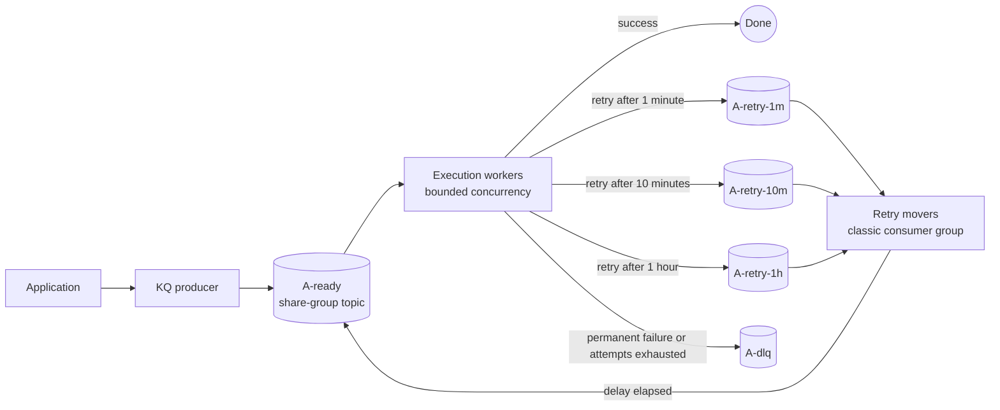
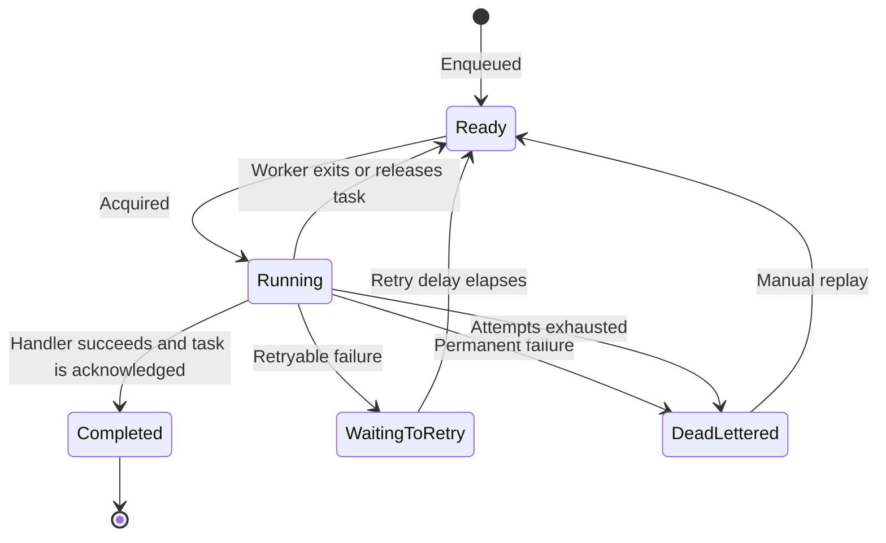

# kq architecture

KQ is an embeddable Go job queue built on Kafka share groups. Producers write
tasks to a ready topic, execution workers perform them, and retry movers return
failed tasks after a fixed delay.

Topic names below are illustrative for a queue named `A`.

## Topology

Execution workers and retry movers are independent runners. A process may run
either one or both, allowing retry movement to be embedded in worker pods or
run as a dedicated deployment. All movers for a queue use the same classic
consumer group.

## Task Lifecycle

Moving a task creates a new Kafka record while preserving its task ID. KQ
confirms the destination write before acknowledging or committing the source,
which prevents task loss but permits duplicate records under failure.

## Components

- [Producer](producer.md)
- [Execution worker](worker.md)
- [Retry mover](retry-mover.md)
- [Proposed public API](../api.md)
- [Design requirements](../requirements.md)
