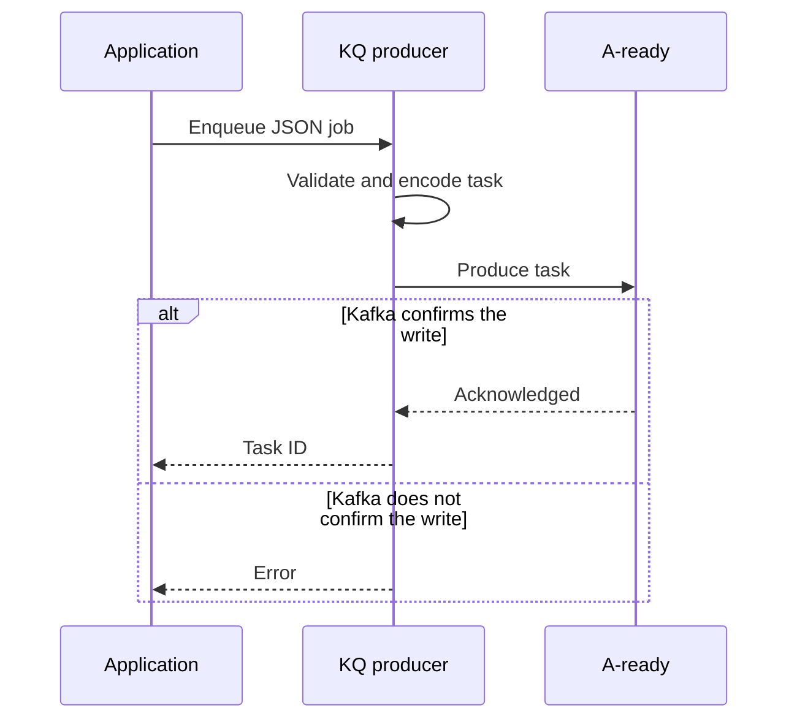

# Producer

The producer converts an application job into a durable record on the queue's
ready topic. It does not execute jobs or participate in retry movement.

## Flow



## Task Envelope

KQ wraps the application payload with the metadata needed to move and execute
the task:

```go
type taskEnvelope struct {
	ID         string
	Type       string
	Payload    []byte
	Attempt    int
	EnqueuedAt time.Time
	LastError  string
}
```

`Payload` contains the JSON representation of the application job. The other
fields belong to KQ and are preserved when the task moves between topics.

The initial ready record has `Attempt` set to `1`. Its Kafka key is the task ID
so every copy of the logical task retains the same identity.

## Enqueue

The producer serializes the job's exported fields, creates the envelope, and
waits for Kafka to confirm the write:

```go
func (c *Client) Enqueue(ctx context.Context, job Job) (TaskInfo, error) {
	if job == nil || strings.TrimSpace(job.Name()) == "" {
		return TaskInfo{}, ErrInvalidJob
	}

	payload, err := json.Marshal(job)
	if err != nil {
		return TaskInfo{}, fmt.Errorf("kq: encode job %q: %w", job.Name(), err)
	}

	envelope := taskEnvelope{
		ID:         newTaskID(),
		Type:       job.Name(),
		Payload:    payload,
		Attempt:    1,
		EnqueuedAt: time.Now(),
	}

	value, err := encodeEnvelope(envelope)
	if err != nil {
		return TaskInfo{}, err
	}

	err = c.writer.Write(ctx, kafkaRecord{
		Topic: c.readyTopic,
		Key:   []byte(envelope.ID),
		Value: value,
	})
	if err != nil {
		return TaskInfo{}, fmt.Errorf("kq: enqueue job: %w", err)
	}

	return TaskInfo{ID: envelope.ID}, nil
}
```

`recordWriter.Write` represents a synchronous durability boundary. It returns
success only after Kafka acknowledges the record according to the configured
producer durability settings.

```go
type recordWriter interface {
	Write(context.Context, kafkaRecord) error
}
```

## JSON Jobs

A JSON job can contain worker-only dependencies because unexported fields are
not serialized:

```go
type SendEmailJob struct {
	To       string `json:"to"`
	Template string `json:"template"`

	mailer Mailer
}
```

The producer creates this job with only `To` and `Template`. A worker factory
injects `mailer` after the record reaches the worker. See the
[proposed public API](../api.md#json-jobs) for the complete example.

## Failure Behavior

If encoding fails, no Kafka write is attempted. If Kafka does not confirm the
write, enqueue returns an error and does not claim that the task is durable.
The producer does not retry application jobs itself; transport-level retries
are handled by the Kafka client.

An interrupted produce can have an ambiguous outcome: Kafka may have stored
the record even though the caller received an error. This is one reason task
execution remains at least once and handlers must tolerate duplicates.
