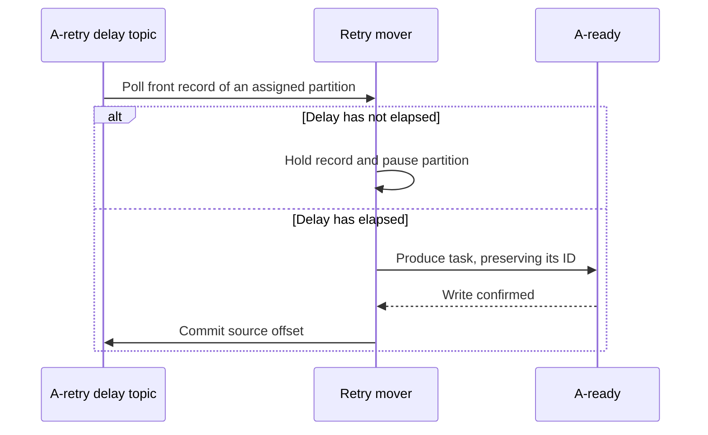

# Retry Mover

The retry mover consumes fixed-delay retry topics using a classic Kafka
consumer group. Once a record's delay has elapsed, the mover writes it back to
the ready topic and commits the retry offset.

## Retry Topics

For a queue named `A`, a policy such as `[1m, 10m, 1h]` creates:

| Topic | Minimum delay |
| --- | ---: |
| `A-retry-1m` | 1 minute |
| `A-retry-10m` | 10 minutes |
| `A-retry-1h` | 1 hour |

Each topic is an ordinary Kafka topic. All mover instances for queue `A` join
the same deterministic consumer group so each retry partition has one active
owner.

## Flow



If the ready write fails, or the mover exits before committing, the retry
offset remains uncommitted and the record is fetched again.

## Eligibility

A retry record becomes eligible after its topic's delay has elapsed from its
Kafka timestamp:

```go
func (m *RetryMover) eligibleAt(record *consumerRecord) time.Time {
	delay := m.delayByTopic[record.Topic]
	return record.Timestamp.Add(delay)
}
```

Retry topics should use Kafka log-append timestamps. This gives records in a
partition timestamps based on broker append order rather than the clocks of
individual worker processes.

When the front record is not eligible, the mover pauses that partition and
continues polling other assigned partitions. Sleeping the entire consumer
would unnecessarily block unrelated retry partitions.

## Moving a Record

The mover produces before committing:

```go
func (m *RetryMover) move(ctx context.Context, record *consumerRecord) error {
	if dueAt := m.eligibleAt(record); time.Now().Before(dueAt) {
		m.hold(record)
		m.consumer.Pause(record.Topic, record.Partition)
		m.resumeAt(record.Topic, record.Partition, dueAt)
		return nil
	}

	err := m.writer.Write(ctx, kafkaRecord{
		Topic: m.readyTopic,
		Key:   record.Key,
		Value: record.Value,
	})
	if err != nil {
		return err
	}

	return m.consumer.Commit(ctx, record)
}
```

The record value is not rewritten by the mover. The execution worker already
incremented the attempt and selected the retry topic before writing it.

## Partition Processing

Kafka offsets are contiguous, so the mover must not commit past a record it
has not moved. It processes the eligible prefix of each partition in order:

```go
func (m *RetryMover) processFetch(
	ctx context.Context,
	records []*consumerRecord,
) {
	for _, partition := range groupByPartition(records) {
		for _, record := range partition {
			if time.Now().Before(m.eligibleAt(record)) {
				m.holdAndPause(record)
				break
			}

			if err := m.move(ctx, record); err != nil {
				break
			}
		}
	}
}
```

Pausing a partition only stops additional fetches. Records already returned by
Kafka must remain buffered by the mover until their earlier records are moved.
A higher-throughput implementation may produce a contiguous eligible batch
and commit its highest offset after every destination write is confirmed.

## Deployment

The retry mover is independent from the execution worker and has its own Kafka
consumer client.

It may run in every worker process:

```go
return kq.Run(ctx, worker, retryMover)
```

Or in a dedicated deployment:

```go
return retryMover.Run(ctx)
```

Both deployment styles use the same mover consumer group and may coexist. If
no mover is running, existing retries remain in their retry topics until one
starts, subject to topic retention.

The baseline mover is non-transactional. A crash after producing to the ready
topic but before committing the retry offset may create a duplicate ready
record, which is permitted by KQ's at-least-once delivery model.
