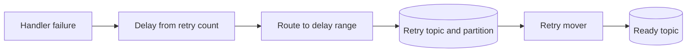
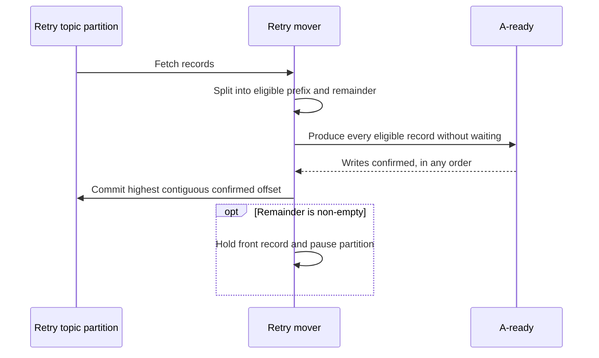

# Retry Mover

The retry mover returns failed tasks to the ready topic after a count-based
retry delay. KQ groups arbitrary desired delays into a finite grid of Kafka
topic-partition delay buckets. This keeps scheduling entirely in Kafka without
requiring a timestamp-ordered external store.

## Retry Semantics

The retry policy computes a desired delay from the retry number. The initial
execution is not a retry, so the first failure requests retry number one.

```go
retryNumber := envelope.Retried + 1
desiredDelay := policy.Delay(retryNumber, envelope.ID)
```

The policy may be exponential, quartic, or application-defined, but it must be
determined by the retry number. A jittered policy should derive its jitter from
the task ID and retry number rather than mutable process-local randomness. This
makes a duplicate transition choose the same delay again.

An Asynq-style policy can be expressed as:

```go
func retryDelay(retryNumber int, taskID string) time.Duration {
	n := retryNumber - 1
	base := n*n*n*n + 15
	jitterMax := 29 * (n + 1)
	jitter := stableHash(taskID, retryNumber) % (jitterMax + 1)
	return time.Duration(base+jitter) * time.Second
}
```

KQ treats the desired delay as a lower bound. A task may be released later due
to an earlier record in its partition, mover availability, or backlog, but
never earlier.

## Delay Grid

A delay grid converts the desired delay into a concrete topic and partition.
Each topic represents a broad delay band, and each partition represents one
delay range within that band.

The partition count is configurable. The examples below use four partitions
only to make the bucket mapping concrete. An illustrative grid covering delays
through four days is:

| Topic | Covered range | P0 range | P1 range | P2 range | P3 range |
| --- | ---: | ---: | ---: | ---: | ---: |
| `A-retry-0s` | 0s-2m | 0s-30s | 30s-1m | 1m-1m30s | 1m30s-2m |
| `A-retry-2m` | 2m-8m | 2m-3m30s | 3m30s-5m | 5m-6m30s | 6m30s-8m |
| `A-retry-8m` | 8m-30m | 8m-13m30s | 13m30s-19m | 19m-24m30s | 24m30s-30m |
| `A-retry-30m` | 30m-2h | 30m-52m30s | 52m30s-1h15m | 1h15m-1h37m30s | 1h37m30s-2h |
| `A-retry-2h` | 2h-8h | 2h-3h30m | 3h30m-5h | 5h-6h30m | 6h30m-8h |
| `A-retry-8h` | 8h-1d | 8h-12h | 12h-16h | 16h-20h | 20h-1d |
| `A-retry-1d` | 1d-2d | 1d-1d6h | 1d6h-1d12h | 1d12h-1d18h | 1d18h-2d |
| `A-retry-2d` | 2d-4d | 2d-2d12h | 2d12h-3d | 3d-3d12h | 3d12h-4d |

Ranges include their upper bound. A delay exactly on a shared boundary uses
the lower band's final partition.

These boundaries and the partition count are configuration, not part of the
retry formula. Wider bands use wider buckets because minute-level precision
matters less for a retry that is already days away. More partitions provide
narrower ranges and smoother release at the cost of more partition replicas.

The grid selects the partition range containing the desired delay. It does not
replace the desired delay with the range's upper bound:

```text
desired 44s  -> A-retry-0s / P1 -> eligible after 44s, bounded by 1m
desired 70s  -> A-retry-0s / P2 -> eligible after 70s, bounded by 1m30s
desired 4m   -> A-retry-2m / P1 -> eligible after 4m, bounded by 5m
desired 7m   -> A-retry-2m / P3 -> eligible after 7m, bounded by 8m
```

```go
bucket, ok := retryGrid.Bucket(desiredDelay)
if !ok {
	return ErrRetryDelayOutOfRange
}
```

The configured grid therefore also defines the maximum supported delay. A
policy that can return a longer delay must add another band or treat that task
as exhausted.

## Routing

The execution worker computes the retry delay and stores that exact duration in
the task envelope. A duration is stored instead of an absolute timestamp so
eligibility can be based on the broker's append timestamp rather than the
worker's clock. The worker then increments the retry metadata and writes the
task directly to the selected topic and partition:

```go
record := kafkaRecord{
	Topic:     bucket.Topic,
	Partition: bucket.Partition,
	Key:       []byte(envelope.ID),
	Value:     encodedEnvelope,
}
```

The task ID remains the Kafka key, but retry records use manual partition
selection because the partition identifies the delay range. Hashing a timestamp
as the key would send equal timestamps to the same partition and create a
hotspot; Kafka does not sort records by key or timestamp.

The retry write must be confirmed before the worker accepts the ready record:



If the retry write fails, the worker releases the ready record. A crash after
the retry write but before the ready acknowledgement may create a duplicate
retry record, which is permitted by KQ's at-least-once delivery model.

## Eligibility

Every retry record carries its exact desired delay. It becomes eligible after
that duration has elapsed from the record's Kafka timestamp:

```go
func (m *RetryMover) eligibleAt(record *consumerRecord) time.Time {
	return record.Timestamp.Add(record.RetryDelay)
}
```

Retry topics use Kafka log-append timestamps so timestamps are assigned by the
broker in append order rather than by individual worker clocks.

Exact eligibility times do not necessarily remain in offset order because
records in the same partition may have different delays. Kafka offsets still
prevent the mover from passing an earlier record:

```text
P2 covers delays greater than 60s and up to 90s

offset 10: desired 90s
offset 11: desired 70s
```

If offset 10 is still waiting, offset 11 cannot move even after its own 70-second
delay elapses. Both may move at 90 seconds. If offset 11 is at the front, it may
move at 70 seconds.

This head-of-line delay is bounded by the partition range under normal
operation. For a record appended at time `t`, every preceding record was
appended no later than `t` and has a delay no greater than the range's upper
bound. All predecessors are therefore eligible by `t + upperBound`, allowing
the record to move by then. Mover downtime, processing time, and backlog can
delay it further, so the upper bound is not a delivery SLA.

## Moving Records

All mover instances for queue `A` join the same classic consumer group, giving
each retry partition one active owner.



The mover produces before committing. Within a partition it issues the writes
for the whole eligible prefix concurrently and commits once, rather than
waiting for each record's write and then its commit in turn. Ordering is
enforced by the commit, not by the writes:

```go
func (m *RetryMover) moveBatch(ctx context.Context, eligible []*consumerRecord) error {
	confirmed := make([]bool, len(eligible))
	var wg sync.WaitGroup

	for i, record := range eligible {
		wg.Add(1)
		m.writer.ProduceAsync(ctx, kafkaRecord{
			Topic: m.readyTopic,
			Key:   record.Key,
			Value: record.Value,
		}, func(err error) {
			confirmed[i] = err == nil
			wg.Done()
		})
	}
	wg.Wait()

	done := 0
	for done < len(eligible) && confirmed[done] {
		done++
	}

	incomplete := done < len(eligible)
	if incomplete {
		// Unconfirmed records were already returned by the fetch. Rewind so
		// they are fetched and produced again.
		m.consumer.Seek(eligible[done])
	}
	if done > 0 {
		if err := m.consumer.Commit(ctx, eligible[done-1]); err != nil {
			return err
		}
	}
	if incomplete {
		return errIncompleteBatch
	}
	return nil
}
```

A Kafka commit is a single offset meaning every earlier offset is complete, so
the mover commits only the longest prefix of confirmed writes. A failed write
holds back its own offset and every offset after it, even if those later writes
succeeded. Those later records are produced again on the next fetch; the
resulting duplicates are permitted by KQ's at-least-once model. An
implementation may re-produce only the failed records before committing to
avoid them.

The mover does not rewrite the record value. If the mover exits before
committing, the retry offsets remain uncommitted and the records are fetched
again. A crash after the ready writes but before the commit may create up to
one batch of duplicate ready records. The fetch size therefore bounds both
per-partition throughput and the duplicate blast radius of a crash, and should
be configurable.

## Partition Processing

Kafka offsets are contiguous, so the mover processes only the eligible prefix
of each assigned partition. It must never commit past an ineligible or failed
record.

```go
func (m *RetryMover) processFetch(ctx context.Context, records []*consumerRecord) {
	now := time.Now()

	for _, partition := range groupByPartition(records) {
		eligible, rest := splitEligible(partition, now)

		if len(eligible) > 0 {
			if err := m.moveBatch(ctx, eligible); err != nil {
				// moveBatch already rewound to the first unconfirmed record;
				// the remainder is fetched again with it.
				continue
			}
		}

		if len(rest) > 0 {
			m.holdAndPause(rest[0])
		}
	}
}
```

`splitEligible` returns the longest prefix whose records are all eligible at
`now`, and everything after it. Records in the prefix are moved concurrently;
records in the remainder wait for the front record's delay regardless of their
own.

Pausing a partition only stops additional fetches. Records already returned by
Kafka remain buffered until their earlier records are moved. The mover may
continue processing eligible records from other assigned partitions.

## Topology Changes

The partition number is part of the delay-range identity. A grid may be created
with any supported partition count, but that count must then be treated as
immutable for its existing topics. Changing a band's boundaries or partition
count requires new topics and a migration plan for records still in the old
grid.

Retry-topic retention must exceed the partition's maximum delay plus the maximum
expected mover outage. If no mover is running, records remain in their retry
topics only until retention removes them.

## Deployment

The retry mover has its own Kafka consumer client and is independent from the
execution worker. It may run alongside every worker process or as a dedicated
deployment. Both styles use the same mover consumer group and may coexist.

The baseline mover is non-transactional. Its write-before-commit ordering
prevents task loss but permits duplicates under failure, bounded per partition
by the fetch size.
