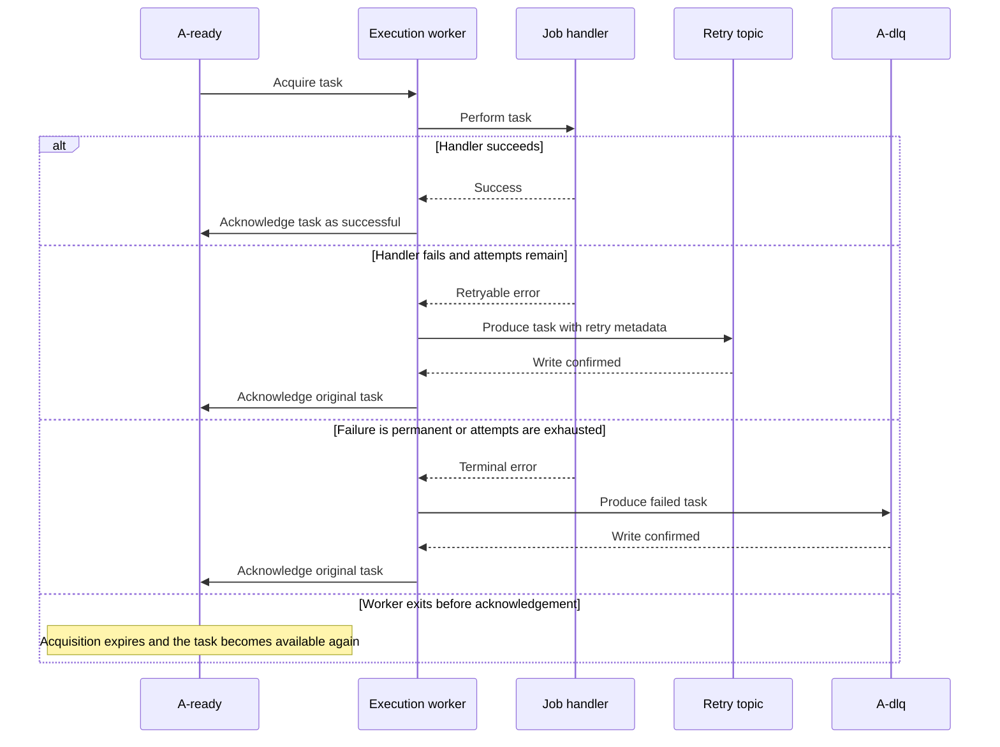

# Execution Worker

The execution worker acquires tasks from the ready topic through a Kafka share
group and runs application handlers with bounded concurrency.

## Flow



## Fixed Pool And Bounded Acquisition

`Run` starts exactly the configured number of long-lived pool goroutines. The
calling goroutine polls Kafka, feeds a bounded jobs channel, receives results,
and owns all acknowledgement flushing. Tasks reuse the existing pool; the
worker does not create a goroutine per task.

```go
func (w *Worker) Run(ctx context.Context) error {
	jobs := make(chan workerJob, w.concurrency)
	results := make(chan workerResult, w.concurrency)
	workers := startFixedPool(ctx, w.concurrency, jobs, results)
	defer stopFixedPool(jobs, workers)

	for {
		records := w.consumer.Poll(ctx, w.concurrency)
		dispatch(records, jobs)
		resolve(records, results)
		w.consumer.FlushAcks(ctx)
	}
}
```

The concrete Kafka consumer enforces the same acquisition limit. Because the
current share consumer auto-accepts unresolved records on the next poll, a new
generation is not polled until every record in the prior generation has a
terminal decision and its acknowledgements have been flushed.

A slow record can therefore delay refill after faster peers in its generation
finish. Continuous refill requires explicit acknowledgements and acquisition
renewal and is intentionally outside the simple fixed-pool design.

## JSON Job Dispatch

Handlers are registered with factories rather than preconstructed job values.
The factory creates a fresh job and injects its runtime dependencies before KQ
decodes the JSON arguments onto it.

```go
func (m *ServeMux) HandleJob(factory JobFactory) {
	prototype := factory()
	name := prototype.Name()

	if _, exists := m.handlers[name]; exists {
		panic("kq: duplicate job handler for " + name)
	}

	m.handlers[name] = func(ctx context.Context, payload []byte) error {
		job := factory()
		if err := json.Unmarshal(payload, job); err != nil {
			return Permanent(fmt.Errorf("kq: decode job %q: %w", name, err))
		}
		return job.Perform(ctx)
	}
}
```

Creating a new job per task prevents argument data from being shared between
concurrent executions.

## Handler Outcomes

Every acquired record resolves to success, retry, or terminal failure:

```go
func (w *Worker) execute(ctx context.Context, record *shareRecord) {
	envelope, err := decodeEnvelope(record.Value)
	if err != nil {
		w.deadLetterRaw(ctx, record, err)
		return
	}

	err = w.mux.Process(ctx, envelope.Type, envelope.Payload)

	switch {
	case err == nil:
		record.Acknowledge()

	case IsPermanent(err):
		w.moveToDLQ(ctx, record, envelope, err)

	default:
		w.retryOrDeadLetter(ctx, record, envelope, err)
	}
}
```

Handler panics are recovered and treated as retryable failures. Invalid task
envelopes, invalid JSON, and unknown task types are terminal failures because
retrying them cannot repair the record.

## Retrying

The configured delays determine whether another attempt remains. For delays
`[1m, 10m, 1h]`, attempt four is the final execution attempt.

```go
func (w *Worker) retryOrDeadLetter(
	ctx context.Context,
	record *shareRecord,
	envelope taskEnvelope,
	cause error,
) {
	delay, ok := w.queue.retryDelay(envelope.Attempt)
	if !ok {
		w.moveToDLQ(ctx, record, envelope, cause)
		return
	}

	envelope.Attempt++
	envelope.LastError = cause.Error()

	if err := w.writeEnvelope(ctx, w.queue.retryTopic(delay), envelope); err != nil {
		record.Release()
		return
	}

	record.Acknowledge()
}
```

The destination write is confirmed before the ready record is acknowledged.
If the worker exits between those operations, Kafka can retain both records;
this produces a duplicate rather than losing the task.

## Terminal Failure

Permanent and exhausted tasks are moved to the DLQ with the same ordering rule:

```go
func (w *Worker) moveToDLQ(
	ctx context.Context,
	record *shareRecord,
	envelope taskEnvelope,
	cause error,
) {
	envelope.LastError = cause.Error()

	if err := w.writeEnvelope(ctx, w.queue.dlqTopic(), envelope); err != nil {
		record.Release()
		return
	}

	record.Acknowledge()
}
```

KQ never automatically consumes the DLQ. Manual replay creates a new ready
record using the original task identity and payload.

## Shutdown and Recovery

Graceful shutdown stops polling, lets dispatched handlers observe context
cancellation, waits for them to return, releases canceled records, and flushes
acknowledgements. Handlers must honor context cancellation; this implementation
does not yet impose a separate shutdown deadline.

If a process crashes or loses an acquisition before acknowledgement, Kafka
expires the acquisition and makes the record available to another worker.
