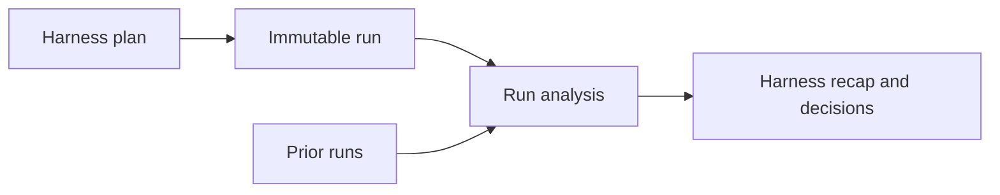

# Performance Artifacts

This directory stores published performance evidence separately from
implementation plans, machine-readable benchmark definitions, and recaps.

Benchmark definitions live with the executable harness:

- [Scenarios](../../bench/scenarios) define stable workload behavior.
- [Profiles](../../bench/profiles) define scale and topology.
- [RPS sweeps](../../bench/sweeps) define ordered, repeated arrival rates.

Published evidence lives under `runs/`:

```text
runs/
|-- _templates/                            canonical artifact formats
`-- YYYY-MM-DD-<scenario>-<revision>/      immutable published evidence
```

## Artifact Model



A run records one harness execution. It normally references a catalogue
scenario, but may instead contain an ad hoc workload with `scenario` set to
`null`. Its machine-generated metadata and results must not be edited after
publication. AI-generated interpretation belongs in the run's `analysis.md`.

A sweep manifest groups independent runs by target RPS and repetition. It links
their immutable run IDs without combining or rewriting their measurements.

Comparisons reference immutable run IDs directly. They do not copy or rewrite
the raw results of prior runs.

## Run IDs

Run directories use:

```text
YYYY-MM-DD-<scenario>-<revision>
```

The scenario component is the catalogue ID or a short `adhoc-*` label.

Example:

```text
runs/2026-09-18-serial-success-054333d/
```

Catalogue runs record their scenario identity:

```json
{
  "scenario": {
    "id": "ready-success-v1",
    "version": 1
  }
}
```

Ad hoc runs record `"scenario": null`; their `purpose` and resolved workload
describe what was executed.

## Run Contents

```text
run.json       environment and workload inputs
result.json    machine-generated output
analysis.md    AI-generated observations and suggestions
```

Large logs, profiles, and traces should remain CI artifacts or external object
storage. The run metadata may link to them, but they should not be committed to
this directory by default.

## Generating Analysis

The analysis generator receives only `run.json`, `result.json`, and retained
diagnostics, and keeps evidence and recommendations distinct:

```text
Observation: p95 delivery latency rose from 20ms to 400ms at 500 tasks/s.
Interpretation: the serial worker remained continuously occupied.
Suggestion: measure bounded worker concurrency against the same workload.
```

The generated analysis must not present a hypothesis as a measured fact. It
must record environmental caveats that could invalidate comparisons.
