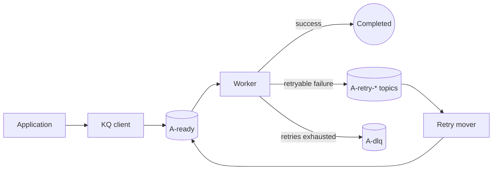
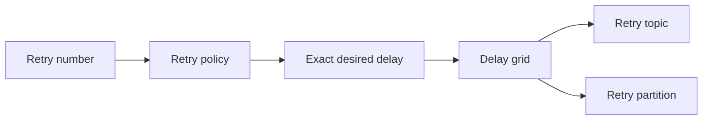
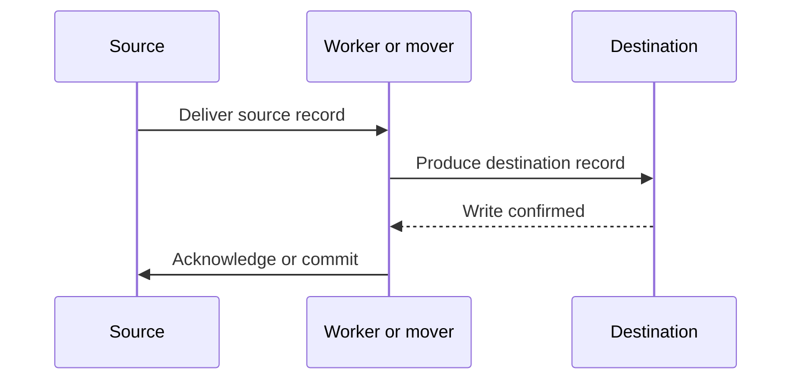

# 0001: Core Delivery

## Objective

Build the minimum complete task-delivery lifecycle using Kafka as the only
durable store:

```text
enqueue
-> execute
-> retry after a delay
-> execute again
-> dead-letter after exhaustion
```

The system prioritizes preventing task loss. Duplicate execution is allowed
under failure and must be visible to callers as part of the at-least-once
delivery contract.

## Scope

This plan covers:

- A protobuf task envelope with stable identity and delivery metadata.
- Synchronous enqueue to a ready topic.
- Serial execution through a Kafka share group.
- Count-based retry delays.
- Kafka topic-partition delay buckets.
- Serial movement of eligible retries back to ready.
- Dead-lettering after retry exhaustion.
- Unit and Kafka integration coverage for the complete lifecycle.

## Topology



The ready topic uses a Kafka share group named `kq.A.workers`. Retry topics use
a classic consumer group named `kq.A.retry-mover`.

## Task Envelope

Each Kafka record carries a protobuf envelope containing:

```text
task ID
task type
opaque payload
enqueue timestamp
maximum retries
completed retry count
current retry delay
execution constraints
last failure metadata
application metadata
```

The application-facing `Task` contains only type and payload. Queue-owned
delivery state remains in the envelope.

## Retry Semantics

The initial execution is not a retry. The first handler failure requests retry
number one.

```text
initial execution: retried = 0
first retry:       retried = 1
second retry:      retried = 2
```

A retry policy computes the exact desired delay from the retry number. That
delay is stored in the envelope as `retry_after`.

The retry grid maps the delay to a topic and partition range:



For example, a four-partition band covering zero through two minutes may use:

```text
A-retry-0s
├── P0: 0s-30s
├── P1: 30s-60s
├── P2: 60s-90s
└── P3: 90s-120s
```

A 70-second retry is eligible after exactly 70 seconds but is placed in P2.
An earlier P2 offset may delay it up to the partition range's 90-second upper
bound.

Retry eligibility is anchored to the retry record's broker append timestamp:

```text
eligible at = broker append timestamp + retry_after
```

## Transition Ordering

Every state transition writes the destination before resolving the source.



The ordering applies to all transitions:

```text
ready -> retry
retry -> ready
ready -> DLQ
```

A destination write failure leaves the source unresolved. A process failure
after the destination write but before source resolution may create a duplicate
destination record, but must not lose the task.

## Serial Processing

The initial worker and retry mover process one record at a time. When a retry
record is not yet eligible, the mover retains it, pauses that partition, and
continues polling other partitions. It resumes the partition after all locally
held records for that partition have moved.

## Test Plan

The integration suite must cover:

```text
enqueue -> worker success
```

```text
enqueue -> worker failure -> retry -> mover -> worker success
```

```text
enqueue -> worker failure -> retries exhausted -> DLQ
```

Tests must verify stable identity, payload preservation, retry timing, retry
counts, failure metadata, destination topics, and write-before-source-resolution
ordering.
