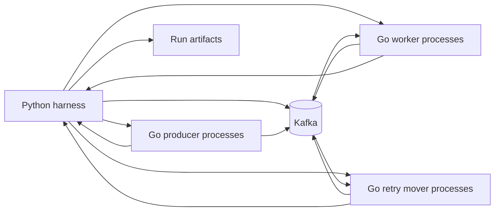
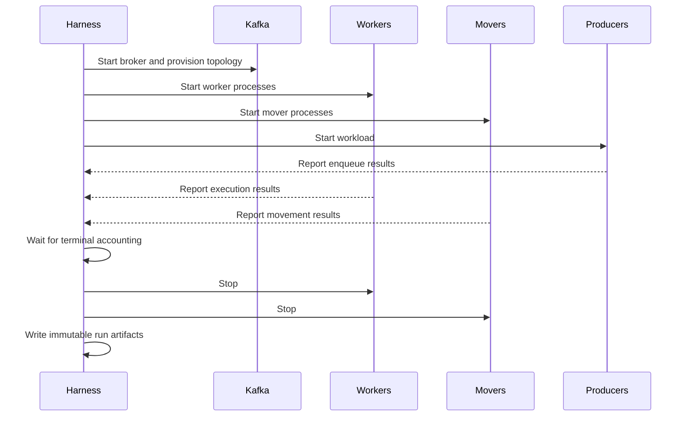

# 0002: Performance Harness

## Objective

Build a reproducible harness that measures KQ performance and correctness across
different workloads, topologies, and implementation strategies.

The harness must answer:

```text
How do enqueue throughput and latency change as producer load scales?
How do worker throughput and latency change across workloads and topologies?
How quickly do retry movers return eligible work to ready queues?
Where does backlog accumulate, and which component is saturated?
How does the system recover from failures and retry bursts?
Does any configuration introduce missing or duplicate executions?
How does a proposed change compare with prior runs?
```

## Scope

The harness runs real KQ components against Kafka and records both performance
and correctness. Producers, workers, and retry movers run as separate processes
so measurements include their actual network clients and deployment boundaries.

The harness itself orchestrates processes, applies timeouts, gathers result
events, checks task accounting, and writes machine-readable artifacts. Queue
behavior remains in Go programs using KQ.

## Architecture



Python is responsible only for orchestration and aggregation. The producer,
worker, and mover processes are Go binaries built from the revision under test.

## Repository Layout

The harness is a top-level tool rather than integration-test support:

```text
bench/
|-- cmd/kq-load/       Go producer, worker, and mover process roles
|-- internal/          Shared Go workload and event packages
|-- scenarios/         Stable versioned workload definitions
|-- profiles/          CI and controlled-runner scale settings
|-- kqbench/           Python orchestration and result aggregation
|-- compose.yaml       Local Kafka environment
|-- pyproject.toml     uv project and kq-bench entrypoint
`-- uv.lock            Locked Python environment
```

```text
test/integration/   correctness integration tests
bench/              executable performance harness
docs/performance/   published immutable run artifacts
```

## Workload Model

Each generated task carries a stable harness identifier and behavior settings
inside its payload:

```json
{
  "workload_id": 12345,
  "enqueued_at": "2026-09-18T12:00:00Z",
  "simulated_execution_time_ms": 10,
  "failure_mode": "permanent",
  "fail_until": null,
  "fail_attempts": 0
}
```

`workload_id` allows correctness accounting independently of KQ's internal task
ID. `simulated_execution_time_ms` is the execution time sampled for that task.
The failure fields materialize the behavior selected by the run profile so all
worker processes execute the same workload.

Profiles describe arrival rate, execution-time distribution, and failures:

```json
{
  "arrival": {
    "target_rps": 50000,
    "duration_seconds": 60
  },
  "execution_time_ms": {
    "average": 10,
    "p95": 50,
    "p99": 100
  },
  "failures": {
    "rate": 0.01,
    "mode": "permanent"
  },
  "random_seed": 1
}
```

`target_rps` is the requested enqueue arrival rate, not guaranteed throughput.
The result records the achieved enqueue rate and completion rate separately.

Failure modes are:

| Mode | Behavior |
| --- | --- |
| `none` | Every task succeeds. |
| `permanent` | Selected tasks fail every execution and reach the DLQ. |
| `until_time` | Selected tasks fail until a shared outage timestamp. |
| `attempts` | Selected tasks fail their first configured number of executions. |

The failure rate selects workload IDs deterministically using `random_seed`.
Retries of the same workload ID therefore retain the same failure selection.

These three values do not uniquely define a probability distribution. The
harness must use a documented sampler, seed it deterministically, and record
the actual generated average, p95, and p99 with every run.

## Scenarios

| Scenario | Behavior | Question |
| --- | --- | --- |
| Ready success | Every task succeeds | What capacity can the ready path sustain? |
| Handler latency | Tasks sample an execution-time distribution | When does execution become the bottleneck? |
| Permanent failure | Selected tasks always fail | Can retries and DLQ account for every task? |
| Temporary outage | Tasks fail until a timestamp | How does retry backlog recover? |
| Retry herd | Many retries become eligible together | Can the serial mover drain the burst? |

Most runs use stable, versioned workload definitions shared by local runs, CI,
and published performance runs. The catalogue lives in
[`docs/performance/scenarios`](../performance/scenarios/README.md).

A profile supplies scale and environment choices without changing scenario
semantics:

```text
scenario: what behavior is exercised
profile:  how large and where it runs
```

For example, `ready-success-v1` can run with both `ci-smoke` and `benchmark`
profiles. Each run stores the fully resolved scenario and profile configuration
so results remain reproducible if catalogue defaults later change.

The harness also accepts an ad hoc workload configuration when a catalogue
scenario does not fit the question being investigated:

```bash
uv run --project bench kq-bench run \
  --config /path/to/adhoc.json \
  --profile benchmark \
  --output artifacts/performance
```

Ad hoc runs record `scenario` as `null`, a required purpose, and the same fully
resolved workload and topology fields as catalogue runs. If an ad hoc workload
is reused, it should be promoted to a new versioned catalogue scenario.

Each profile declares the capabilities and lifecycle assumptions required by
its scenario. Unsupported scenarios must be reported as skipped with a reason,
not coupled to another implementation plan or silently approximated.

## Measurements

The harness records:

```text
enqueue throughput and latency
requested versus achieved enqueue rate
task delivery and completion latency
retry scheduling delay
eligible-to-ready retry lag
retry mover throughput
DLQ throughput
backlog depth over time
process CPU and memory
duplicate handler executions
missing workload IDs
```

Latency percentiles use p50, p95, and p99. Execution-time workloads and observed
execution times additionally report average, p95, and p99. Throughput is
reported as records per second over both the active workload interval and the
complete drain interval.

A run configured for 50,000 RPS may report a lower achieved rate. The harness
must not treat the requested rate as a measurement:

```json
{
  "throughput": {
    "requested_enqueue_per_second": 50000,
    "achieved_enqueue_per_second": 43750,
    "completed_per_second": 12000
  }
}
```

## Correctness Accounting

A completed run must satisfy:

```text
produced workload IDs
= successfully completed workload IDs
+ dead-lettered workload IDs
+ explicitly reported outstanding workload IDs
```

For a fully drained run, `outstanding` and `missing` must both be zero.

Duplicate execution is measured separately:

```text
duplicates = total handler executions - unique workload IDs executed
```

Performance results are invalid if correctness accounting cannot explain every
produced workload ID.

## Run Lifecycle



Every process has a startup deadline, workload deadline, and shutdown deadline.
On failure, the harness captures process output and Kafka state before cleanup.

## CI Execution

The same Python entrypoint must run locally and in CI. Profiles control workload
size and duration without changing harness behavior:

```bash
uv run --project bench kq-bench run \
  --scenario ready-success-v1 \
  --profile ci-smoke \
  --output artifacts/performance
```

Pull requests run a short `ci-smoke` profile that validates process startup,
task accounting, result generation, and cleanup. Its timing data is diagnostic
only because shared CI runners do not provide stable performance measurements.

Authoritative performance runs use a pinned `benchmark` profile on a controlled or
dedicated runner. They may be started manually or on a schedule:

```bash
uv run --project bench kq-bench run \
  --scenario ready-success-v1 \
  --profile benchmark \
  --output artifacts/performance
```

CI uploads `run.json`, `result.json`, process logs, and diagnostics for every
run, including failures. CI artifacts are not committed automatically. A run is
copied into `docs/performance/runs` only when it is intentionally selected as
part of an investigation or comparison.

## Artifacts

Artifact conventions and templates live under
[`docs/performance`](../performance/README.md).

Each run records:

```text
run.json       resolved scenario, profile, environment, topology, and command
result.json    machine-generated measurements and correctness counts
analysis.md    AI-generated observations, interpretation, suggestions, and caveats
```

Comparisons reference immutable run IDs rather than copying or editing their
raw results.

## Acceptance Criteria

The harness is complete when:

- One command runs a scenario locally and in CI.
- A bounded smoke profile completes reliably on pull-request runners.
- A benchmark profile can run on a controlled runner without code changes.
- Every catalogue scenario can run under compatible local and CI profiles.
- Ad hoc configurations run through the same execution and artifact pipeline.
- Producer, worker, and mover roles run as separate processes.
- Every process reports readiness before workload timing begins.
- Every produced workload ID is accounted for.
- Duplicate execution is reported rather than hidden.
- Requested and achieved enqueue rates are reported separately.
- Execution workloads support target average, p95, and p99 durations.
- Failure workloads support a deterministic rate and explicit failure mode.
- Throughput and latency percentiles are written to `result.json`.
- Failed and timed-out runs retain useful diagnostics.
- CI uploads artifacts even when correctness checks fail.
- Repeated runs with the same inputs are comparable.
