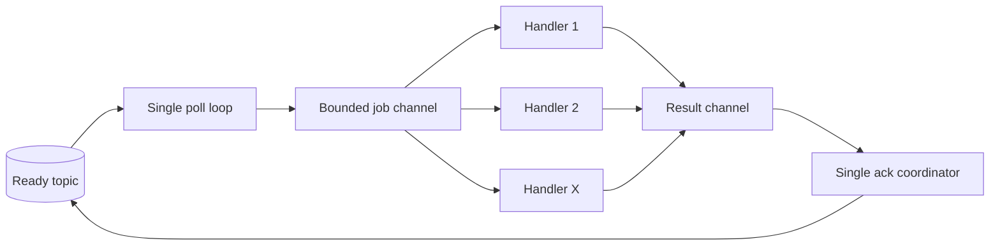

# 0003: Worker Concurrency

## Objective

Replace the worker's serial execution loop with a bounded pool of goroutines so
one worker process can execute up to `Concurrency` tasks at once.

This is intentionally the simplest concurrency step. It establishes bounded
parallel execution and safe per-record resolution without adding dynamic pool
size, consumer shards, continuous refill, acquisition renewal, or explicit-ack
streaming.

## Motivation

The first published performance sweep found that two serial worker processes
plateau around 310 to 315 tasks per second while producers continue to sustain
the requested load. Queue latency rises continuously above 300 RPS.

The next measurement should hold process topology and workload distribution
fixed while increasing execution capacity inside each worker process.

## Scope

This plan covers:

- An explicit worker concurrency setting.
- One poll loop and a fixed pool of handler goroutines.
- At most `Concurrency` tasks executing at once.
- Per-record accept or release decisions after task handling completes.
- Serialized share acknowledgement flushing.
- Graceful cancellation and worker-pool shutdown.
- Unit and Kafka integration coverage for concurrent execution.
- Harness configuration and a before/after performance run.

This plan does not cover:

- Concurrent retry-mover execution.
- Autoscaling or changing concurrency while a worker is running.
- Multiple Kafka consumers inside one worker.
- Polling a new record while every pool slot is occupied.
- Share-record acquisition renewal for long-running handlers.
- Explicit acknowledgements across successive polls.
- Ordering between tasks.

## Configuration

Add worker-specific configuration without changing queue-wide client settings:

```go
type WorkerConfig struct {
	Config
	Concurrency int
}

func NewWorker(config WorkerConfig, handler Handler) (*Worker, error)
```

`Concurrency` must be positive. The initial release requires callers to choose
it explicitly rather than hiding a machine-dependent default. Existing callers
that need current behavior use `Concurrency: 1`.

The handler contract changes from serial to concurrent: a handler and all of
its dependencies must be safe to call from multiple goroutines when
`Concurrency > 1`.

## Execution Model

The worker owns one Kafka share-group consumer and one fixed goroutine pool:



The poll loop is the only producer of jobs. The job channel is bounded by the
configured concurrency, so local memory and in-flight work remain bounded.
Each pool goroutine calls the existing task lifecycle logic and reports the
record plus its accept-or-release decision to the coordinator.

The coordinator owns acknowledgement flushing. Pool goroutines do not call
`FlushAcks` concurrently.

## Record Lifecycle

Each record follows exactly one path:

```text
poll
-> dispatch to one pool goroutine
-> decode and invoke handler
-> write retry or DLQ destination when required
-> report accept or release
-> flush acknowledgement
```

The existing at-least-once transition rule remains unchanged:

```text
destination write succeeds before source accept
destination write failure causes source release
```

Successful handling, successful retry scheduling, and successful
dead-lettering accept the source record. Decode, handler-transition, or
destination-write failures release it.

Records may complete and be acknowledged in a different order from polling.
No per-key or per-partition execution ordering is promised.

## Kafka Polling Constraint

The current franz-go share consumer auto-resolves unresolved records when the
next poll begins. Therefore the simple implementation must not poll again while
records from the previous poll generation remain unresolved.

For this first step, each generation is bounded by `Concurrency`:

```text
poll up to X records
-> execute those records concurrently
-> resolve and flush all X records
-> poll the next generation
```

This removes serial handler execution but may leave capacity idle when one task
in a generation is much slower than the others. Continuous refill requires
explicit acknowledgements and acquisition renewal and is deferred to a later
plan.

The consumer's share maximum and poll limit are both set to `Concurrency` so a
generation cannot exceed the pool.

## Errors

A task-level failure that is successfully converted to a retry or DLQ record is
not a worker-fatal error. An infrastructure or lifecycle failure releases the
affected source record and stops the worker after the generation's records are
resolved and acknowledgement flushing has been attempted.

When several concurrent tasks fail, return an error that preserves all
available causes with `errors.Join`. A flush failure is joined with task errors
rather than replacing them.

## Shutdown

On context cancellation:

```text
stop polling
stop dispatching new records
let dispatched handlers observe the canceled context
wait for every pool goroutine to return
release records that did not complete successfully
flush final acknowledgements
stop the pool
return
```

The initial implementation relies on handlers honoring context cancellation.
A bounded shutdown timeout and forced release of stuck acquisitions remain
future work; they should be added together with explicit acknowledgements so a
record can be safely released independently of its poll generation.

`Close` continues to close Kafka resources after `Run` has returned. Concurrent
use of `Run` and `Close` is not expanded by this plan.

## Test Plan

Unit tests must verify:

- Invalid concurrency is rejected.
- `Concurrency: 1` preserves serial execution.
- No more than `Concurrency` handlers execute at once.
- More than one handler executes at once when work is available.
- A fast task may finish before an earlier slow task.
- Every polled record receives exactly one accept or release decision.
- The worker does not begin a new poll generation before the current one is
  resolved and flushed.
- Retry and DLQ writes still happen before source acceptance.
- Destination-write and acknowledgement-flush failures are returned without
  losing other concurrent errors.
- Cancellation drains the pool and does not leak goroutines.

Kafka integration coverage must enqueue more tasks than the configured pool,
block handlers at a barrier, observe the configured number running
concurrently, release them, and account for every task exactly once at terminal
state.

Run unit and integration tests with the race detector where practical.

## Performance Validation

Extend the harness topology with per-process worker concurrency:

```json
{
  "topology": {
    "producers": 2,
    "workers": 2,
    "worker_concurrency": 8,
    "movers": 1
  }
}
```

Every run records the resolved value. Re-run the published ready-success RPS
sweep with all prior inputs fixed except worker concurrency:

```text
ready partitions:       1
producers:               2
worker processes:        2
movers:                  1
execution distribution: 5/10/20 ms average/p95/p99
worker concurrency:      compare 1 with selected bounded values
RPS points:              200, 300, 325, 400, 800
```

The comparison must report throughput, queue latency, drain time, duplicate
executions, missing tasks, CPU, and memory. Correctness accounting remains a
hard validity requirement.

## Acceptance Criteria

The plan is complete when:

- Callers can configure a positive fixed concurrency per worker process.
- The worker executes up to that many handlers concurrently.
- In-flight task count never exceeds the configured bound.
- Poll generations do not overlap under franz-go's current share-ack behavior.
- Each record is accepted or released exactly once.
- Retry and DLQ transitions retain write-before-source-resolution ordering.
- Cancellation waits for dispatched handlers and performs a final ack flush.
- Existing lifecycle tests pass with `Concurrency: 1`.
- Concurrent unit and Kafka integration tests pass under the race detector.
- The harness records worker concurrency in immutable run configuration.
- A controlled before/after sweep is published and fully accounted for.
