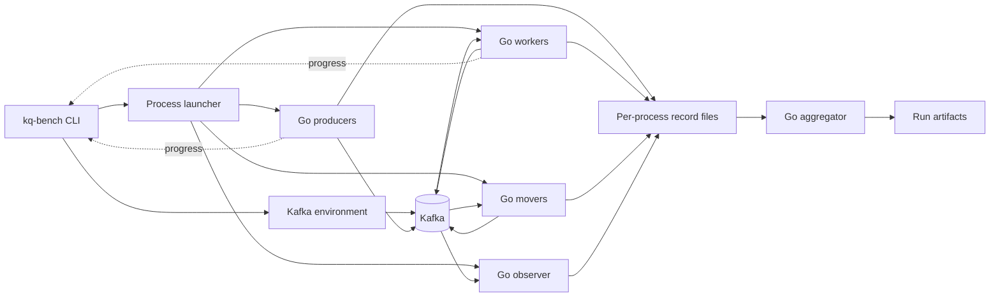

# 0004: Scalable Harness

## Objective

Make `kq-bench` capable of validating KQ at and beyond the north-star workload
with full correctness accounting, on one host or across several, and retire
the ad hoc probe used for the 2026-09-23 runs.

The harness must measure the system under test without becoming its
bottleneck:

```text
Can the harness generate 40,000+ tasks/s of north-star load on one host?
Does harness overhead stay small relative to KQ and Kafka?
Can the same run definition execute against a local or an external Kafka cluster?
Can process roles run on hosts other than the orchestrator?
Can a capacity ramp run from one command and stop at the first failing point?
```

## Motivation

The 2026-09-23 runs found that the harness, not KQ, set the local ceiling:

- [Harness capacity](../performance/runs/2026-09-23-north-star-steady-v1-harness-capacity-33c95bf/analysis.md)
  sustained 12,000 RPS and overloaded at 16,000 RPS with the host fully
  saturated. At 12,000 RPS, harness Python used 1.73 cores and producers used
  2.75 cores, against 0.77 cores for every KQ worker combined. Python memory
  reached about 2.6 GB for a 45 s run.
- The [lean probe](../performance/runs/2026-09-23-adhoc-lean-probe-capacity-33c95bf/analysis.md)
  drove the same KQ code to 150,000 tasks/s on the same host by removing
  per-event JSON, serial enqueue, and in-memory rescans.
- Runs 4 to 6 needed broker overrides, 1000 worker instances, per-second
  completion series, and acceptance-based ramps. The harness supported none of
  these, so their `run.json` and `result.json` were assembled by hand.

The specific bottlenecks are:

| Cause | Location | Effect |
| --- | --- | --- |
| One serial `Enqueue` per producer process | `bench/internal/roles/producer.go` | One Kafka request per task; many processes needed. |
| Four JSON events per task on stdout | `bench/internal/events` | Encoding cost on the hot path. |
| One Python thread per process parsing stdout | `bench/kqbench/processes.py` | GIL-bound parsing; all events held in memory. |
| Accounting recomputed every second | `bench/kqbench/run.py` | Quadratic in run size. |
| Blocking event writer | `bench/internal/events/writer.go` | A slow reader stalls producers and handlers. |
| `docker compose exec` provisioning | `bench/kqbench/kafka.py` | Local Kafka only. |

The blocking writer is also a correctness risk for measurements: if the
harness falls behind, it slows the system under test.

## Scope

This plan covers:

- Concurrent, open-loop enqueue within each producer process.
- Compact per-task records written to local files, not stdout.
- A Go aggregator that computes accounting and latency from those files.
- Low-volume progress reporting for readiness and drain detection.
- Topic provisioning and cleanup through the Kafka admin API.
- A Kafka environment abstraction with local-compose and external-cluster
  implementations.
- A process-launcher abstraction with a local implementation.
- Broker configuration overrides declared in profiles and recorded per run.
- Multiple worker instances per worker process.
- Per-process CPU and memory telemetry and per-second throughput series.
- Acceptance-based ramps.
- A `north-star-steady-v2` scenario using measured production percentiles.
- Validation against the published probe runs.

This plan does not cover:

- GCP infrastructure, Terraform, or Kubernetes manifests. A remote launcher
  for those environments is a later plan built on the launcher interface.
- KQ library changes. Internal consumer sharding is [0005](0005-internal-consumer-sharding.md).
- Prometheus or production metrics.
- Continuous refill, acquisition renewal, or bounded shutdown.

## Architecture



Python remains responsible for orchestration only. It no longer parses
per-task events. Per-task data flows from Go processes to files and from files
to a Go aggregator.

## Producer

Each producer process owns one `kq.Client` shared by a configurable number of
enqueue goroutines:

```json
{
  "topology": {
    "producers": 2,
    "producer_concurrency": 512
  }
}
```

Arrival remains open-loop. Workload ID `n` is due at `start + n / target_rps`
regardless of when earlier enqueues complete. Goroutines claim the next ID from
a shared counter, wait until it is due, stamp `enqueued_at`, and enqueue.

The producer records schedule lag, the delay between the due time and the
actual enqueue start. If lag grows, the generator is saturated, and the run is
reported as generator-limited instead of attributing the shortfall to KQ.

`producer_concurrency: 1` preserves the current serial behavior.

## Per-Task Records

Per-task lifecycle data moves from JSON on stdout to fixed-width binary
records in a per-process file:

```text
record kind       uint8    enqueue | handler | dead_letter | retry_move
result            uint8    success | error
attempt           uint16
workload_id       uint64
started_unix_ns   int64
finished_unix_ns  int64
```

Each role writes records through a buffered writer to `--records-out <path>`.
The writer never blocks the hot path on a slow reader because nothing reads it
during the run. A write failure stops the process with an error.

Existing event types map to record kinds:

```text
enqueue_started + enqueue_finished   -> enqueue
handler_started + handler_finished   -> handler
dead_lettered                        -> dead_letter
retry_moved                          -> retry_move
```

Error messages are not stored per record. Each process keeps bounded counts of
distinct error messages and emits them in its final progress report.

## Progress Reporting

Processes keep emitting JSON lifecycle events on stdout at low volume:

```text
process_ready
progress         once per second: cumulative counters, CPU, and RSS
process_error
process_stopped
```

A progress event carries cumulative counts:

```json
{
  "type": "progress",
  "role": "worker",
  "process": 3,
  "at": "2026-09-24T12:00:01Z",
  "enqueued": 0,
  "enqueue_errors": 0,
  "handled": 18234,
  "handler_errors": 0,
  "dead_lettered": 0,
  "retry_moved": 0,
  "cpu_seconds": 4.21,
  "rss_bytes": 83886080
}
```

The orchestrator detects readiness and drain from these counters only. It no
longer re-runs accounting during the run. Warm-up completion is detected by
worker handler counts reaching the warm-up task count.

## Aggregation

A new `kq-load aggregate` subcommand reads all record files for a run and
writes `result.json`. It streams records and holds only per-workload state
needed for accounting and a list of latencies for percentile calculation.

Definitions do not change from [0002](0002-performance-harness.md), so new
results remain comparable with published runs:

```text
enqueue latency  = enqueue finished - enqueue started
queue time       = first handler started - enqueue finished
delivery time    = terminal handler finished - enqueue finished
duplicates       = handler executions - unique workload IDs executed
```

The aggregator also emits:

- Per-second enqueue and completion series.
- Queue maximum in addition to p50, p95, and p99.
- Schedule-lag percentiles.
- Per-role CPU cores and peak RSS from progress events.
- The first-to-last-completion window after production ends.

The aggregator is the only accounting implementation. The Python
`accounting.py` and `metrics.py` are removed once aggregator tests reproduce
their existing unit-test cases.

## Kafka Environments

Kafka setup is behind an environment interface:

```python
class KafkaEnvironment(Protocol):
    def start(self) -> None: ...
    def provision(self, config: dict[str, Any]) -> None: ...
    def capture_diagnostics(self, output: Path) -> None: ...
    def cleanup(self, config: dict[str, Any]) -> None: ...
    def stop(self) -> None: ...
```

Two implementations are required:

| Environment | Lifecycle | Isolation |
| --- | --- | --- |
| `local-compose` | Starts and stops `bench/compose.yaml` per run. | Fresh broker per run, as today. |
| `external` | Uses brokers named in the profile; never starts or stops them. | Unique queue name per run; topics and group config deleted on cleanup. |

Provisioning moves from `docker compose exec` to a `kq-load provision`
subcommand using the franz-go admin client. It creates ready, retry, and DLQ
topics with the configured partition counts and replication factor, and sets
share-group configuration such as `share.auto.offset.reset`.

## Broker Configuration

Profiles may declare static broker overrides for the local environment:

```json
{
  "kafka": {
    "environment": "local-compose",
    "broker_config": {
      "group.share.max.size": 1000,
      "group.share.partition.max.record.locks": 4000
    },
    "replication_factor": 1
  }
}
```

The local environment renders these into a generated compose override. Every
run records the effective broker configuration read back through the admin
API, not only the requested values. External environments record the observed
configuration and fail when a required override is absent.

## Process Launching

Process placement is behind a launcher interface:

```python
class Launcher(Protocol):
    def start(self, role: str, index: int, run_config: Path) -> ManagedProcess: ...
    def collect(self, output: Path) -> None: ...
    def stop(self, grace_seconds: float) -> None: ...
```

This plan implements the local launcher. `collect` copies record files and
process logs into the run directory. A remote launcher for Kubernetes or VMs
implements the same interface in a later plan without changing orchestration,
aggregation, or artifacts.

## Topology

Worker processes may host several independent worker instances to reproduce
the member counts used in runs 4 to 6 before [0005](0005-internal-consumer-sharding.md)
lands:

```json
{
  "topology": {
    "workers": 10,
    "worker_instances_per_process": 100,
    "worker_concurrency": 20
  }
}
```

Each instance is a separate `kq.Worker` and share-group member. The resolved
run records total share-group members and total slots. When 0005 adds shards,
the topology gains `worker_shards`, and both fields remain available for
comparison.

A settle interval after worker readiness is configurable and recorded. At 1000
members, runs 4 to 6 used 40 s.

## Ramps

A ramp definition extends a sweep with acceptance limits and a stop rule:

```json
{
  "id": "north-star-ramp-v1",
  "description": "Find the highest arrival rate that keeps queue time near the Redis reference.",
  "scenario": "north-star-steady-v2",
  "target_rps": [20000, 24000, 28000, 32000, 36000, 40000],
  "repetitions": 1,
  "stop": "first_failure",
  "acceptance": {
    "queue_p50_ms": 50,
    "queue_p95_ms": 150,
    "queue_p99_ms": 300,
    "max_tail_seconds": 3,
    "min_enqueue_ratio": 0.99
  }
}
```

Each point is an independent run with its own immutable artifacts. The sweep
manifest records each point's acceptance result and the highest passing rate.
Acceptance never overrides correctness: a point with missing, outstanding, or
unexplained workload IDs is invalid, not merely failing.

## Scenarios and Profiles

Add `north-star-steady-v2` with the measured production execution
distribution. `north-star-steady-v1` stays unchanged so published runs keep
their meaning:

```json
{
  "id": "north-star-steady-v2",
  "version": 2,
  "description": "Production steady workload: measured execution time 250 ms average, 500 ms p95, 650 ms p99.",
  "behavior": {
    "failure_mode": "none",
    "execution_time_ms": {
      "average": 250,
      "p95": 500,
      "p99": 650
    }
  }
}
```

The sampler fits the lognormal to average and p99 and accepts p95 within 5% of
the implied value. For 250 / 650 ms the implied p95 is about 479 ms, 4.3% below
500 ms, so v2 validates. Runs will realize a p95 near 479 ms; analyses should
compare that with the 500 ms production figure rather than assume an exact
match.

Add profiles:

| Profile | Purpose |
| --- | --- |
| `local-north-star-members` | 10 workers x 100 instances x concurrency 20, 16 partitions, 1000-member broker override. Reproduces run 6. |
| `local-north-star-capacity` | 4 workers x 8 instances x concurrency 1000, 32 partitions. Reproduces the run 2 capacity shape. |

`ci-smoke` keeps its current bounded size and must still complete on pull
request runners.

## CLI

Existing commands stay compatible:

```bash
uv run --project bench kq-bench run --scenario ready-success-v1 --profile ci-smoke
uv run --project bench kq-bench sweep --name north-star-rps-v1 --profile local-baseline
```

New command:

```bash
uv run --project bench kq-bench ramp \
  --name north-star-ramp-v1 \
  --profile local-north-star-members \
  --set topology.ready_partitions=16
```

Add `bench/kqbench/__main__.py` so the harness also runs as
`PYTHONPATH=bench python -m kqbench` when the package cannot be built.

## Artifacts

`run.json` adds:

```text
kafka.environment, kafka.broker_config (effective), kafka.replication_factor
topology.producer_concurrency, topology.worker_instances_per_process
topology.share_group_members, topology.total_slots
startup.settle_seconds
harness schema_version
```

`result.json` adds:

```text
latency_ms.queue_max, latency_ms.schedule_lag_p50/p95/p99
series.enqueue_per_second, series.completed_per_second
resources.<role>.cpu_cores, resources.<role>.peak_rss_bytes
resources.kafka.cpu_cores (local environment only)
windows_ms.tail_after_production
```

Existing field names keep their meaning. Update `docs/performance/runs/_templates`
to match, with a `schema_version` so older runs remain valid under the prior
shape.

## Test Plan

Unit tests must verify:

- Producer goroutines never exceed `producer_concurrency` in-flight enqueues.
- Open-loop scheduling assigns due times independently of enqueue latency.
- Schedule lag is recorded when enqueues fall behind.
- Record encoding and decoding round-trip for every record kind.
- Aggregation reproduces every current `test_accounting.py` and
  `test_metrics.py` case, including duplicates, dead letters, warm-up
  exclusion, missing, and outstanding IDs.
- Aggregation streams input without loading all records at once.
- Ramp stop rules and acceptance evaluation, including invalid points.
- Broker override rendering and effective-configuration readback.
- The external environment never starts or stops brokers and deletes only
  topics and group configuration it created.

Integration coverage must run every scenario currently in the CI matrix
through the new pipeline with `ci-smoke`.

## Performance Validation

Validate on the same host used for the 2026-09-23 runs:

| Check | Reference | Requirement |
| --- | --- | --- |
| Harness overhead at 12,000 RPS | Run 1: Python 1.73, producers 2.75 cores | Python below 0.2 cores; producers within 25% of the run 2 probe. |
| Capacity shape at 20,000 to 80,000 RPS | Run 2 | Completions match arrival; queue p50 within 10% of run 2. |
| Member topology at 34,000 RPS, 16 partitions | Run 6: 22 / 66 / 95 ms | Sustained with zero missing or duplicates; queue p50 / p95 / p99 within 20% or 15 ms of run 6, whichever is larger. |
| Ramp at 16 partitions | Run 6 ramp | Same highest passing rate, one step either way. |
| Failure scenarios at 5,000 RPS | None | `permanent-failure-v1` and `temporary-outage-v1` fully accounted for. |

Publish each validation run under `docs/performance/runs`, referencing the
probe runs it reproduces.

## Acceptance Criteria

The plan is complete when:

- One command runs a run, sweep, or ramp against local compose or an external
  cluster.
- Producers enqueue concurrently with open-loop arrival and report schedule
  lag.
- No per-task data passes through Python.
- The event writer can no longer block producers or handlers on a slow
  reader.
- The Go aggregator is the single accounting implementation and preserves
  published metric definitions.
- Topic provisioning and cleanup use the Kafka admin API.
- Broker overrides are declared in profiles and recorded as effective values.
- Worker processes can host multiple worker instances.
- Runs record per-second throughput series and per-role CPU and memory.
- Harness overhead meets the validation table on the reference host.
- Runs 2 and 6 are reproduced through `kq-bench` within tolerance.
- `north-star-steady-v2` exists and `v1` is unchanged.
- CI smoke runs pass for every scenario and upload artifacts on failure.

## Open Questions

- Should the probe under run 2 remain as a reference implementation after
  validation, or be removed in favor of the harness?
- Is 40,000 tasks/s on one host the right generator target, or should the
  target be set by the GCP test plan?
- Should the external environment support deleting topics, or only creating
  uniquely named ones and leaving cleanup to cluster retention?
