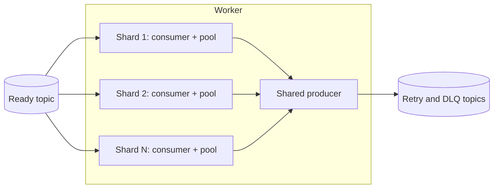

# 0005: Internal Consumer Sharding

## Objective

Let one `kq.Worker` run several independent share-group consumers, called
shards, so a single worker process can supply many small poll generations and
reach Redis-level queue time at north-star throughput.

This keeps the fixed-generation model from [0003](0003-worker-concurrency.md)
inside each shard. It does not add continuous refill.

## Motivation

The 2026-09-23 runs showed that queue time is dominated by the generation
wait, and that many small generations remove most of it:

- [Queue-latency diagnosis](../performance/runs/2026-09-23-adhoc-queue-latency-diagnosis-33c95bf/analysis.md):
  with zero execution time, queue p99 was 6 ms. With north-star execution at
  concurrency 1000, it was 1,105 ms at only 2,000 RPS. A new record waits for
  the in-progress generation, whose length is set by its slowest task.
- [Share group with 1000 members](../performance/runs/2026-09-23-adhoc-share-group-1000-members-33c95bf/analysis.md):
  1000 members x concurrency 10 sustained 20,000 RPS with 14 / 104 / 203 ms
  queue p50 / p95 / p99 at 8 partitions, and collapsed at 2 and 4.
- [Shard-20 ramp](../performance/runs/2026-09-23-adhoc-shard-20-ramp-33c95bf/analysis.md):
  1000 members x concurrency 20 sustained 34,000 RPS at 16 partitions with
  22 / 66 / 95 ms, below the Redis reference of 36 / 77 / 100 ms.

Those runs emulated shards with 1000 separate `kq.Worker` instances across 10
processes. Each instance created its own share consumer and its own producer,
so 1000 members also meant 1000 idle producer clients. Applications should not
need to construct and supervise hundreds of workers to get this behavior.

A single consumer cannot refill freed slots because franz-go finalizes
unresolved share records when the next poll begins. Separate consumers each
poll independently, so shards are the smallest change that exploits the
measured effect.

## Scope

This plan covers:

- A shard count in `WorkerConfig`.
- One share consumer and one fixed handler pool per shard.
- One producer shared by every shard in a worker.
- Independent poll generations, acknowledgement flushing, and shutdown per
  shard.
- Worker-wide error propagation and cancellation.
- Clear errors when the share group is full.
- Operator guidance for member budgets, shard concurrency, and partitions.
- Unit and Kafka integration coverage.
- A performance comparison against the emulated-shard runs.

This plan does not cover:

- Continuous refill or explicit acknowledgement across polls.
- Acquisition renewal or bounded shutdown.
- Changing shard count while a worker runs, or autoscaling.
- Sharding the retry mover.
- Changes to franz-go.
- Metrics. Queue time and completion rate should be exposed before a
  production pilot, in a separate plan.

## Configuration

```go
type WorkerConfig struct {
	Config
	Shards           int // share consumers in this worker
	ShardConcurrency int // records per shard generation and handlers per shard
}
```

Both fields are required. Like `Concurrency` in 0003, neither has a hidden
default; callers choose them explicitly:

```text
share-group members from this worker = Shards
handler slots in this worker         = Shards x ShardConcurrency
```

`ShardConcurrency` replaces 0003's `Concurrency` and keeps its meaning within
a shard: the generation size and handler pool size. `Shards: 1` with
`ShardConcurrency: X` behaves exactly as `Concurrency: X` does today.

Validation:

- `Shards` must be between 1 and 1000, the broker maximum for
  `group.share.max.size`.
- `ShardConcurrency` must be between 1 and `math.MaxInt32`, the limit of
  franz-go's `ShareMaxRecords`.
- `Shards x ShardConcurrency` must not overflow `int`.

Removing `Concurrency` is a breaking API change. Update every caller in the
same change: the harness worker role, integration tests, and examples in
`docs/`. The harness topology renames `worker_concurrency` to
`worker_shard_concurrency` and adds `worker_shards`; resolved runs record both,
and published runs keep their original field names.

## Execution Model



Each shard runs the existing 0003 loop unchanged:

```text
poll up to ShardConcurrency records
-> execute them on the shard's pool
-> resolve and flush the shard's acknowledgements
-> poll the next generation
```

Shards share nothing except the handler, the queue configuration, and the
producer. A slow task delays only its own shard's next poll. The franz-go
producer client is safe for concurrent use, so retry and DLQ writes from every
shard go through one client.

`Worker.Run` starts every shard and returns when all shards have returned.

## Record Lifecycle

The per-record lifecycle and write-before-source-resolution rule from 0003
apply within each shard unchanged. A record is polled, handled, and
acknowledged by exactly one shard. Kafka's share-group delivery is the only
coordination between shards; KQ adds no cross-shard state.

## Errors

A worker-fatal error in any shard cancels every other shard. The worker waits
for every shard to drain under the 0003 shutdown rules, then returns all
causes with `errors.Join`. Errors identify their shard index.

A shard's consumer failing to join because the share group is at
`group.share.max.size` is worker-fatal. The returned error names the broker
limit and the configured shard count so the misconfiguration is obvious.

## Shutdown

On context cancellation, every shard follows the 0003 shutdown sequence
independently:

```text
stop polling
let dispatched handlers observe cancellation
wait for the shard's pool
release unsuccessful records
flush final acknowledgements
```

After every shard has returned, the worker returns. `Close` closes every shard
consumer and then the shared producer, so no shard can write a retry or DLQ
record after the producer closes.

## Resource Cost

Each shard is one franz-go client. It holds connections to the brokers that
lead its fetched partitions and one share session per broker. Clients cannot be
shared between shards because a franz-go share-group client is exactly one
group member.

The runs used 100 members per process. This plan documents that shape as
tested and does not recommend larger per-process shard counts until measured.

## Operator Guidance

Sizing relations, Kafka limits, and measured behavior live in
[`docs/scaling.md`](../scaling.md). Update it with shard terminology:

```text
members per queue   = sum of Shards across every worker process
slots per queue     = members x ShardConcurrency
```

Link it from [`docs/architecture/worker.md`](../architecture/worker.md), and
replace its emulated-shard measurements with this plan's sharded validation
run once published.

## Test Plan

Unit tests with a fake consumer factory must verify:

- `Shards` and `ShardConcurrency` outside their ranges, including 0, are
  rejected; `Shards: 1` creates one consumer.
- A worker with `Shards: N` creates exactly N consumers and one producer.
- Each shard executes at most `ShardConcurrency` handlers at once.
- Total concurrent handlers reach `Shards x ShardConcurrency` when work is
  available.
- A slow task in one shard does not block polling in another.
- Each shard never begins a new generation before its current one is resolved
  and flushed.
- A fatal error in one shard cancels the others and returns joined errors
  naming each shard.
- Cancellation drains every shard and does not leak goroutines.
- `Close` closes all consumers before the shared producer.
- The share-group-full error is surfaced with the configured shard count.

Kafka integration coverage must run a worker with `Shards: 4` and
`ShardConcurrency: 2`, block handlers at a barrier, observe 8 concurrent handlers,
release them, and account for every task exactly once. Existing integration tests must pass after migrating to `Shards: 1`. Run tests with the race detector.

## Performance Validation

This plan depends on [0004](0004-scalable-harness.md) for measurement. Add
`worker_shards` to the harness topology, then compare real shards with the
emulated-shard run 6:

```text
broker:                 group.share.max.size=1000, record locks 4000
scenario:               north-star-steady-v1 (same as run 6)
emulated (reference):   10 processes x 100 workers x Shards 1 x ShardConcurrency 20
sharded (candidate):    10 processes x 1 worker x Shards 100 x ShardConcurrency 20
partitions:             16
ramp:                   24,000 to 36,000 RPS
```

The comparison must report the highest passing rate, queue percentiles, Kafka
CPU, worker CPU and memory, and Kafka client connections per process.

Expected results:

- The same highest passing rate as run 6, one ramp step either way.
- Queue percentiles within the tolerance used in 0004 validation.
- Lower worker memory and fewer client connections, since 1000 producer
  clients become 10.

Then repeat the headline point with `north-star-steady-v2`.

## Acceptance Criteria

The plan is complete when:

- Callers must set `Shards` and `ShardConcurrency` explicitly; `Shards: 1`
  reproduces current behavior.
- Every existing `Concurrency` caller is migrated.
- One worker runs that many independent share consumers with one shared
  producer.
- Per-shard concurrency bounds and generation ordering hold.
- Each record is accepted or released exactly once.
- A fatal shard error stops the worker and preserves every cause.
- Cancellation drains every shard; `Close` never closes the producer before
  the shards.
- A full share group produces an explicit, actionable error.
- Unit and integration tests pass under the race detector.
- `docs/scaling.md` uses shard terminology and cites the sharded run.
- A sharded run matching run 6's topology is published and fully accounted for.

## Open Questions

- Should the worker spread shard startup over time to avoid 100 simultaneous
  group joins per process?
