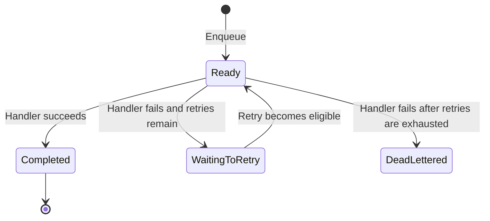
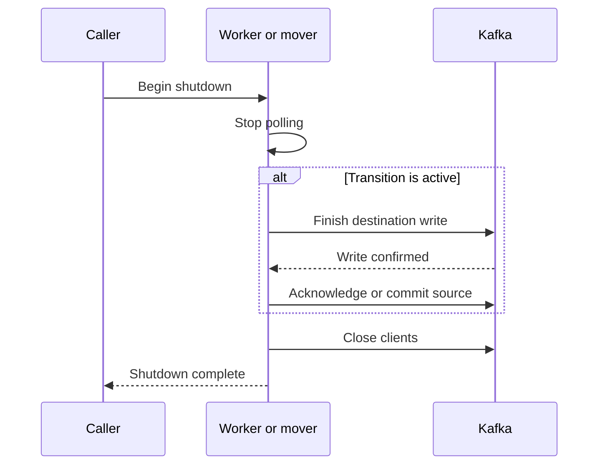
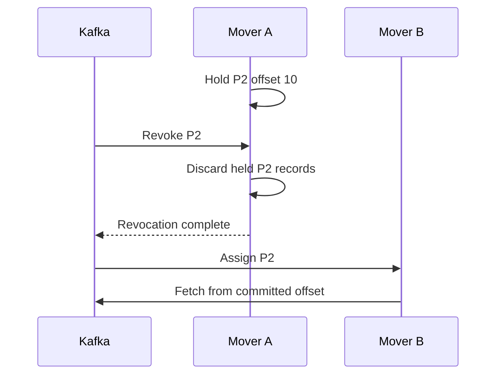
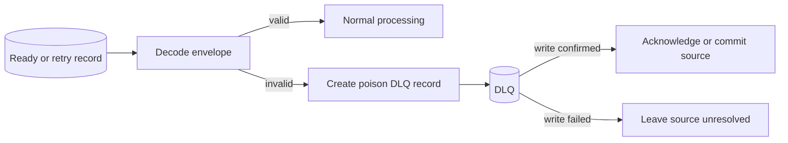

# 0001: Core Delivery Recap

Plan: [0001: Core Delivery](../plans/0001-core-delivery.md)

## Outcome

KQ now supports the complete serial task lifecycle:



The implementation includes:

- Synchronous ready-topic enqueue.
- Serial share-group task execution.
- Count-based retry policy with deterministic task-ID jitter.
- Topic-partition retry delay ranges.
- Serial retry movement through a classic consumer group.
- Dead-lettering after retry exhaustion.
- Separate Kafka producer, share-consumer, and retry-consumer roles.

## Delivery Semantics

All transitions confirm their destination write before resolving their source:

```text
ready -> retry: produce retry, then accept ready
retry -> ready: produce ready, then commit retry
ready -> DLQ:   produce DLQ, then accept ready
```

This prevents task loss but permits duplicates if a process exits between those
two operations. Delivery is at least once.

## Integration Coverage

The Kafka integration suite verifies:

```text
enqueue
-> worker executes successfully
```

```text
enqueue
-> worker fails
-> retry record is written
-> mover waits for retry_after
-> mover returns task to ready
-> worker succeeds
```

```text
enqueue
-> worker fails with no retries remaining
-> task is written to the DLQ
```

The tests assert task identity, type, payload, retry delay, retry count, final
failure metadata, and destination topics.

## Required Follow-Ups

These limitations are directly related to the implemented delivery lifecycle
and must be addressed before production use.

### Graceful Shutdown

Cancellation can interrupt a transition after its destination write but before
its source acknowledgement or commit. Worker and mover shutdown must stop
polling, finish the active transition within a deadline, and only then close
their Kafka clients.



If the shutdown deadline expires, the source must remain unresolved so Kafka
can redeliver it. The required caller contract is:

```text
signal shutdown
-> wait for Run to return
-> close resources
```

### Retry Poll Interval

The mover may poll with a deadline hours or days in the future while waiting for
a held retry. Polling must also wake periodically so the classic consumer does
not exceed `max.poll.interval.ms`.

The poll deadline should be the earlier of the next retry and a short periodic
poll interval:

```go
deadline := time.Now().Add(retryPollInterval)
if wakeAt := m.nextWake(); !wakeAt.IsZero() && wakeAt.Before(deadline) {
	deadline = wakeAt
}

pollCtx, cancel := context.WithDeadline(ctx, deadline)
defer cancel()
```

```text
next retry in 24h
-> poll wakes after 1m
-> mover confirms group membership
-> poll again
```

### Retry Rebalance Ownership

A rebalance can transfer a paused retry partition while its previous mover
still holds records from that partition. Revocation must discard held records
and prevent stale source commits before multiple movers are supported.



An in-flight move must either finish before revocation completes or be fenced
from committing after ownership is lost. Locally pausing P2 does not preserve
group ownership.

### Share Acquisition Lifetime

Handler execution, retry or DLQ production, and final acknowledgement must
finish before the ready record's share acquisition expires. KQ must enforce a
bounded per-execution timeout below that acquisition window or renew the
acquisition while the handler runs.

```text
execution timeout
+ retry or DLQ transition budget
+ acknowledgement budget
+ safety margin
< share acquisition duration
```

If longer executions are supported, the worker must renew the acquisition
while the handler is active:

```go
record.Ack(kgo.AckRenew)
if err := consumer.FlushAcks(ctx); err != nil {
	return fmt.Errorf("kq: renew task acquisition: %w", err)
}
```

Renewal stops before the final `AckAccept` or `AckRelease`. If the worker dies,
renewal stops and Kafka eventually makes the record available again.

### Poll Error Reporting

Franz-go may return records and partition errors in the same poll result. Worker
and mover loops must process the returned record safely and then surface any
accompanying error.

```go
if result.record != nil {
	if err := process(result.record); err != nil {
		return err
	}
}
if result.err != nil {
	return fmt.Errorf("kq: poll: %w", result.err)
}
```

This prevents a valid fetched record from being abandoned while ensuring an
error from another partition is not silently discarded.

### Share Acknowledgement Reporting

`FlushAcks` does not expose every partition-level acknowledgement outcome. The
share consumer must collect `ShareAckCallback` failures and report them with
flush errors.

```go
kgo.ShareAckCallback(func(_ *kgo.Client, results kgo.ShareAckResults) {
	if err := results.Error(); err != nil {
		ackErrors.Add(err)
	}
})
```

```go
func (c *kafkaShareGroupConsumer) FlushAcks(ctx context.Context) error {
	return errors.Join(c.client.FlushAcks(ctx), c.ackErrors.Take())
}
```

Without this callback, a handler can succeed while the broker rejects its
acknowledgement, leaving the task eligible for duplicate execution without a
reported cause.

### Malformed Records

Malformed ready or retry records currently stop their consumer while remaining
available for redelivery. They need a poison-record transition that preserves
the original key and bytes, writes failure context to the DLQ, and only then
resolves the source record.



The poison record must retain the original key and value because decoding may
not recover a valid task ID or payload. Error and source-location information
can be attached as Kafka headers.
