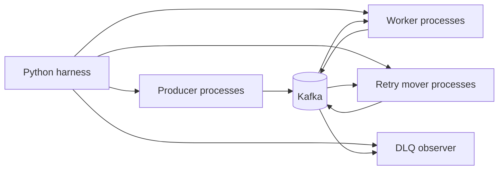
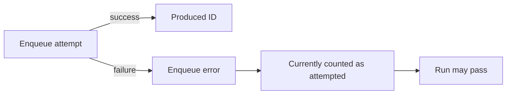
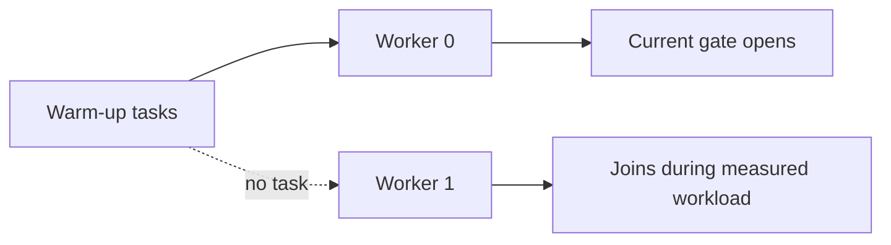
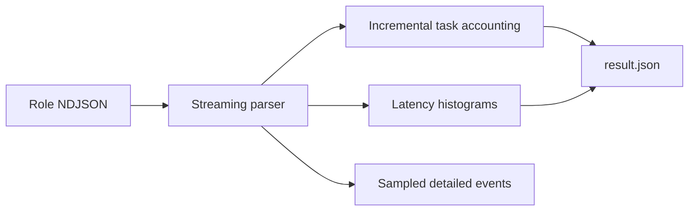

# 0002: Performance Harness Recap

Plan: [0002: Performance Harness](../plans/0002-performance-harness.md)

## Outcome

The harness runs real KQ producer, worker, and retry-mover processes against
Kafka and records performance plus correctness in immutable run artifacts.
One command runs a scenario locally and in CI:

```bash
uv run --project bench kq-bench run \
  --scenario ready-success-v1 \
  --profile ci-smoke \
  --output artifacts/performance
```

Catalogue scenarios:

```text
ready-success-v1      every task succeeds
execution-latency-v1  tasks sample a heavier execution-time distribution
permanent-failure-v1  deterministic failures reach the DLQ
temporary-outage-v1   failures until a shared outage timestamp, then recover
retry-herd-v1         many retries become eligible together
north-star-steady-v1  250 ms average and 646 ms p99 execution target
```

Profiles:

```text
ci-smoke       100 RPS x 5s, 1/1/1 processes, seed 1
local-baseline 200 RPS x 10s, 2/2/1 processes, seed 42
```

The `north-star-rps-v1` sweep runs 5k through 25k requested RPS with three
independent repetitions per point. A profile is supplied at invocation so the
rate progression is independent from topology:

```bash
uv run --project bench kq-bench sweep \
  --name north-star-rps-v1 \
  --profile local-baseline \
  --output artifacts/performance
```

Ad hoc workloads run through the same pipeline with `--config` and record
`scenario` as `null`. Every run writes machine artifacts (`run.json`,
`result.json`, logs) only; `analysis.md` is written separately by pointing
an agent at the run directory and the analysis template. CI uploads the full
`artifacts/performance` directory even on failure. Correctness accounting
requires every produced workload ID to resolve
to completed, dead-lettered, or explicitly outstanding; missing work fails the
run. Duplicates are reported, not hidden. Requested and achieved enqueue
rates are reported separately.

## Process Model

The harness builds one Go binary and launches each KQ role as a separate process:



Role processes emit newline-delimited JSON events. The Python harness owns
configuration resolution, Kafka provisioning, process lifecycle, event
aggregation, deadlines, cleanup, and artifact writing.

Each role queues events through a bounded asynchronous writer. Graceful process
exit drains every queued event, and an output failure makes the role fail rather
than silently invalidating correctness accounting.

## Configuration Model

Catalogue scenarios define stable execution-time and failure behavior. Profiles
define arrival scale and process topology. Sweeps define ordered target rates
and repetitions while taking their profile at invocation.

```text
scenario behavior
+ profile scale
+ command-line overrides
= resolved run configuration
```

Ad hoc configurations use the same resolution and validation pipeline. Every
role receives the same resolved `run.json`.

Execution durations use a deterministic lognormal model with a required
average and optional p95, p99, and maximum. P99 determines the shape when
present; otherwise p95 does. Supplying neither produces a constant duration.
When both percentiles are present, p95 validates the average-and-p99 fit. The
maximum is a hard cap, and results report realized average, p95, p99, and max.

## Warm-Up And Measurement Windows

Before measured producers start, the harness enqueues a reserved range of
always-successful workload IDs and waits for them to complete. This proves the
share group is usable without mixing cold-start backlog into steady-state
metrics.

Warm-up IDs are excluded from task accounting and measured latency windows.
Startup remains visible as a separate measurement.

```text
startup window: earliest worker ready -> first warm-up execution
enqueue window: first measured enqueue start -> last measured enqueue finish
active window:  first measured handler start -> last measured handler finish
drain window:   workload end -> last terminal outcome
total duration: Kafka start -> cleanup complete
```

## Correctness Accounting

The harness assigns every generated task a stable workload ID and tracks
enqueue, handler, and DLQ events independently of KQ's internal task ID.

```text
produced
= completed
+ dead-lettered
+ outstanding
```

Fully drained runs require `missing = 0` and `outstanding = 0`. Duplicate
handler starts are counted and reported rather than hidden. Correctness failure
causes a nonzero harness exit even when performance metrics were produced.

## Run Artifacts

Every run writes:

```text
run.json       fully resolved configuration and environment
result.json    machine-generated metrics and correctness counts
logs/          role stderr, NDJSON events, and Kafka diagnostics
```

Sweep execution writes a `sweep.json` manifest that records every target rate,
repetition, child run ID, and exit status. Child `run.json` and `result.json`
files remain the authoritative measurements.

`analysis.md` is generated separately by pointing an agent at the run directory
and the performance analysis template. Selected immutable runs may be copied to
`docs/performance/runs`.

## CI

The `ci-smoke` profile runs catalogue scenarios through the same uv entrypoint
used locally. CI uploads the complete artifact directory on success or failure.
Shared-runner timing is diagnostic, while correctness failures remain fatal.

## Required Follow-Ups

These gaps can invalidate correctness or performance conclusions and must be
addressed before using the harness for high-rate or production-representative
decisions.

### Enqueue Failure Accounting

The producer emits an error event when enqueue fails but currently returns
`ctx.Err()` instead of the enqueue error. If the context remains active, the
producer continues and exits successfully:

```go
_, err = client.Enqueue(ctx, task)
_ = output.Write(events.EnqueueFinished(id, process, started, err))
return ctx.Err()
```

The harness also counts enqueue errors as attempted work. A run can therefore
finish with fewer successfully produced tasks than requested.



The producer must return the enqueue error, and accounting must fail any run
with enqueue errors or a produced count below the resolved task count:

```go
_, err = client.Enqueue(ctx, task)
_ = output.Write(events.EnqueueFinished(id, process, started, err))
return err
```

```python
if accounting.enqueue_errors:
    raise RuntimeError(f"{accounting.enqueue_errors} enqueue failures")
if accounting.produced != config["workload"]["total_tasks"]:
    raise RuntimeError("produced task count does not match requested workload")
```

### Warm-Up Every Worker

Completing the reserved warm-up range proves that the share group can execute
tasks, but one worker could process every warm-up task while another configured
worker is still joining.



The gate must observe at least one successful warm-up execution from every
configured worker process, and the profile must configure at least as many
warm-up tasks as workers:

```python
warm_workers = {
    int(event["process"])
    for event in events
    if event["type"] == "handler_finished"
    and event["result"] == "success"
    and event["workload_id"] in warmup_ids
}

if warmup_ids.issubset(finished) and len(warm_workers) == configured_workers:
    warmup_complete = True
```

### Streaming Event Aggregation

Each managed process currently retains every parsed event in a Python list.
At tens of thousands of tasks per second, enqueue, handler-start, and
handler-finish events can create millions of Python dictionaries and make the
harness the bottleneck.



The reader must update accounting and histograms incrementally instead of
retaining all events:

```python
def observe(event: Event) -> None:
    accounting.observe(event)
    metrics.observe(event)
    if sampler.keep(event):
        sampled_events.append(event)
```

Exact workload-ID accounting may use compact integer sets or bitmaps. Detailed
latency events may be sampled once aggregate histograms are updated.

### Direct Retry Mover Instrumentation

Retry movement throughput is currently inferred from handler errors minus DLQ
outcomes. This cannot distinguish mover delay, duplicate movement, or a retry
that was scheduled but never moved.

The mover needs a direct observation hook or built-in metric emitted only after
the ready write and retry offset commit succeed:

```go
type RetryMoveEvent struct {
	TaskID    string
	Topic     string
	Partition int32
	Offset    int64
	MovedAt   time.Time
}
```

```text
retry record due
-> ready write confirmed
-> retry offset committed
-> emit retry_moved event
```

The harness can then calculate mover throughput and eligible-to-ready lag from
actual transitions rather than inference.

### Scenario-Correct Worker Throughput

`active_worker_per_second` currently divides successful completions by the
active handler window. Permanent-failure scenarios execute handlers but may
produce few or no successful completions, making the reported worker throughput
incorrect.

Worker execution throughput must count all `handler_finished` events. Successful
completion throughput should remain a separate metric:

```python
handler_finishes = sum(event.type == "handler_finished" for event in events)
successful_finishes = sum(
    event.type == "handler_finished" and event.result == "success"
    for event in events
)

worker_execution_rate = handler_finishes / active_span
successful_completion_rate = successful_finishes / active_span
```

### Per-Process Resource Telemetry

The plan calls for CPU and memory measurements, but current run metadata records
only the harness environment. It does not identify whether producers, workers,
movers, the observer, Kafka, or Python consumed the limiting resource.

The harness must sample each role process throughout the measured window and
report at least average and peak CPU and resident memory:

```python
sample = {
    "role": process.role,
    "process": process.index,
    "cpu_percent": psutil.Process(process.pid).cpu_percent(),
    "rss_bytes": psutil.Process(process.pid).memory_info().rss,
    "at": time.time(),
}
```

Kafka container CPU, memory, disk, and network should be captured separately so
client and broker saturation are not conflated.

## Should Follow-Ups

These improvements expand scenario coverage or remove smaller measurement
biases but do not block the current success, permanent-failure, outage, or herd
scenarios.

### Empirical Execution Distribution

The lognormal execution model is a synthetic approximation. It cannot represent
multimodal latency or an arbitrary production tail. Add deterministic sampling
from production histogram buckets when those measurements are available.

### Attempt-Bounded Failures

The harness does not model tasks that fail a fixed number of executions and
then succeed. Add that mode only if a concrete benchmark need arises and KQ has
a process-safe way to make the logical execution count available.

### Measured Producer Warm-Up

The dedicated warm-up producer warms Kafka and the share group, but measured
producer processes still create fresh Kafka clients. Their first enqueue may
include connection and metadata startup.

If a scenario intends to measure steady-state enqueue latency, each measured
producer should issue one excluded warm-up enqueue before its measured event
stream begins. Cold producer startup should remain available as a separate
metric and scenario.

### Automated Analysis Generation

Machine artifacts are produced automatically, while `analysis.md` is generated
later by pointing an agent at the run directory. The harness may eventually
generate the analysis automatically after writing `run.json`, `result.json`,
and diagnostics. Raw machine artifacts must remain usable when analysis
generation is unavailable.

### Repeated-Run Comparison

Sweeps repeat each resolved rate and group the run IDs in one manifest, but they
do not yet report median results or spread. Those aggregate comparisons are
still required before small performance differences drive implementation
decisions.
