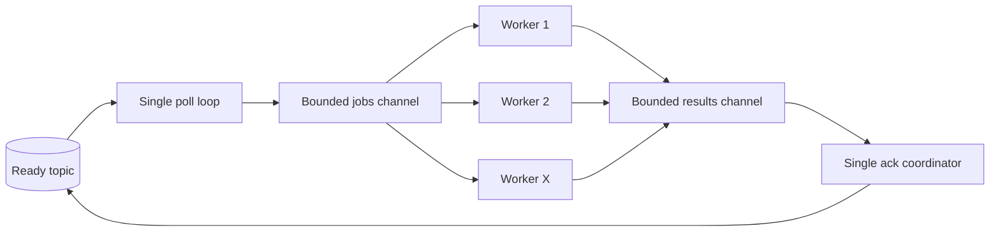

# 0003: Worker Concurrency Recap

Plan: [0003: Worker Concurrency](../plans/0003-worker-concurrency.md)

## Outcome

Workers now execute each bounded Kafka poll generation through a fixed
goroutine pool. The implementation includes:

- A required positive `WorkerConfig.Concurrency` setting.
- One Kafka share-group consumer and one poll loop per worker process.
- Exactly `Concurrency` long-lived handler goroutines.
- Job and result channels bounded by `Concurrency`.
- At most `Concurrency` active handlers per worker process.
- One coordinator for polling, record acknowledgements, and acknowledgement
  flushing.
- Graceful draining of the current generation during cancellation.

The worker does not create a goroutine per task. `Concurrency: 1` preserves the
previous serial behavior. When concurrency is greater than one, the handler and
all dependencies it calls must be safe for concurrent use.

The performance harness records `topology.worker_concurrency`. Its CI smoke
profile uses concurrency 2, while its local baseline profile uses concurrency 1.

## Execution Model

The worker starts its pool once when `Run` begins:



All pool goroutines compete to receive from the same jobs channel. Each record
is delivered to exactly one goroutine, which runs the existing task lifecycle
and sends the record plus its result back to the coordinator.

The share consumer's maximum fetch size and each poll limit both equal
`Concurrency`, so one generation cannot exceed the pool bound:

```text
poll up to X records
-> dispatch all X records to the fixed pool
-> collect X results as handlers finish
-> acknowledge and flush all X records
-> poll the next generation
```

Handlers may finish in a different order from polling. KQ does not promise
per-key, per-partition, or generation-internal execution order.

## Record And Acknowledgement Semantics

Each worker goroutine preserves the existing write-before-source-resolution
rule:

```text
handler succeeds        -> accept ready record
retry write succeeds    -> accept ready record
DLQ write succeeds      -> accept ready record
decode fails             -> release ready record
retry or DLQ write fails -> release ready record
handler is canceled      -> release ready record
```

Pool goroutines do not flush acknowledgements. The coordinator marks each
record as its result arrives and flushes once after the entire generation has
resolved. It does not poll again before that flush completes because franz-go
auto-finalizes unresolved share records when the next poll begins.

`Record.Ack` only queues the desired outcome inside franz-go. Kafka reports the
per-partition broker result asynchronously through `ShareAckCallback`.
`kafkaShareGroupConsumer` accumulates callback failures under a mutex, then
joins them with `FlushAcks` errors:

```go
func (c *kafkaShareGroupConsumer) FlushAcks(ctx context.Context) error {
	flushErr := c.client.FlushAcks(ctx)
	return errors.Join(flushErr, c.takeAckError())
}
```

This prevents a broker-rejected acknowledgement from being silently lost.
Normal generation failures preserve concurrent task, poll, flush, and callback
causes with `errors.Join`.

## Shutdown

Cancellation drains the already-polled generation before `Run` returns:

```text
cancel context
-> dispatched handlers observe cancellation
-> skip retry and DLQ writes on the canceled context
-> release unsuccessful records
-> flush final acknowledgements
-> close the jobs channel
-> wait for every pool goroutine to exit
```

Cancellation itself is treated as graceful shutdown, so `Run` returns only a
final acknowledgement error when one occurred. `Close` remains a separate
operation and must run after `Run` returns.

## Integration Coverage

Unit coverage verifies:

- Invalid concurrency is rejected.
- Poll and in-flight work remain bounded by `Concurrency`.
- Multiple handlers overlap when work is available.
- Fast tasks may finish and be acknowledged before earlier slow tasks.
- The next generation is not polled before the current acknowledgement flush.
- Concurrent task and acknowledgement failures retain all causes.
- Cancellation releases the current generation, flushes once, and stops every
  pool goroutine.
- Asynchronous share-acknowledgement failures are retained and reported.

Kafka integration coverage preloads more records than the configured pool,
observes four handlers active together, releases them, and accounts for every
task.

The stack passed unit, race, and Kafka integration coverage:

```text
go vet ./...
go test ./...
go test -race ./...
sh test/integration/run.sh
GOFLAGS=-race sh test/integration/run.sh
uv run --project bench python -m unittest discover \
  -s bench/kqbench -t bench -p 'test_*.py' -v
```

## Performance Results

Published run:

- [Worker concurrency sweep](../performance/runs/2026-09-21-ready-success-v1-worker-concurrency-sweep-00bb923/analysis.md)

The comparison held one revision, two producers, two worker processes, one
retry mover, one ready partition, and the workload distribution constant. The
workload used a 5 ms average and 20 ms p99 execution target. Only requested RPS
and per-process worker concurrency varied.

| Concurrency | Highest sustainable tested RPS | 800 RPS worker rate | 800 RPS queue p95 |
| ---: | ---: | ---: | ---: |
| 1 | 300 | 285.5/s | 17.29 s |
| 2 | 400 | 458.6/s | 7.09 s |
| 4 | 400 | 756.1/s | 547 ms |
| 8 | 800 | 801.2/s | 10.9 ms |

Concurrency 8 sustained the highest tested rate of 800 RPS with an 11 ms drain.
At that point it delivered 2.81 times the observed worker throughput of
concurrency 1 and reduced queue p95 by 99.94%.

All 81,000 measured tasks completed with zero duplicate, missing, outstanding,
or dead-lettered workload IDs. The fixed pool removes the measured serial
handler bottleneck without increasing the number of worker processes.

## Required Follow-Ups

These gaps limit the workloads and production behavior supported by the fixed
generation model.

### Bounded Shutdown

Shutdown relies on every handler honoring context cancellation. A stuck handler
prevents its generation from resolving and prevents the pool wait from
finishing. KQ needs a bounded shutdown contract before it can guarantee a
maximum termination time.

The cooperative part can be made explicit with a per-execution deadline:

```go
handlerCtx, cancel := context.WithTimeout(runCtx, config.ExecutionTimeout)
defer cancel()

err := w.handle(handlerCtx, record.Value)
```

This only bounds handlers that honor cancellation. Go cannot forcibly terminate
an arbitrary goroutine; a hard execution boundary requires process isolation or
an application-level handler contract that prevents work after cancellation.

If the deadline expires, unresolved acquisitions must be released without
allowing abandoned handler goroutines to write retries, DLQ records, or final
acknowledgements afterward.

### Share Acquisition Renewal

The implementation does not renew Kafka share-record acquisitions. Handler
execution, retry or DLQ production, and final acknowledgement must all finish
within the broker's acquisition lock duration.

Long-running handlers require periodic `AckRenew` calls that stop before the
terminal accept or release:

```go
pending := make(map[*kgo.Record]struct{}, len(records))
for _, record := range records {
	pending[record] = struct{}{}
}
ticker := time.NewTicker(config.RenewInterval)
defer ticker.Stop()

for len(pending) > 0 {
	select {
	case result := <-results:
		status := kgo.AckAccept
		if result.err != nil {
			status = kgo.AckRelease
		}
		w.consumer.Ack(result.record, status)
		delete(pending, result.record)
	case <-ticker.C:
		for record := range pending {
			w.consumer.Ack(record, kgo.AckRenew)
		}
		if err := w.flushAcks(); err != nil {
			return err
		}
	}
}
```

Renewal remains coordinator-owned so pool goroutines never race concurrent
flushes. Each renewal flush must finish before a later renewal or terminal
acknowledgement for the same record.

### Continuous Refill And Heavy Tails

A generation waits for its slowest task before the next poll. Fast workers can
therefore sit idle behind one slow task even when Kafka has ready work:

```text
generation: fast fast fast slow
            done done done running
next poll:  blocked until slow finishes
```

Run a heavy-tail benchmark that exposes this head-of-line blocking before
adding continuous refill. Polling while earlier records remain unresolved
requires a different acknowledgement strategy and acquisition renewal, so the
additional complexity should be justified by measured evidence.

The benchmark should inject deterministic outliers rather than relying on a
short lognormal tail:

```go
func executionTime(rng *rand.Rand) time.Duration {
	if rng.Float64() < 0.01 {
		return 2 * time.Second
	}
	return 5 * time.Millisecond
}
```

Compare the fixed-generation worker with a continuous-refill prototype at the
same total concurrency, arrival rate, process topology, and generated duration
sequence.

### Resource Telemetry And Repetitions

The concurrency sweep ran each point once on one local arm64 laptop. It records
runner metadata but not per-process worker CPU or memory. Add worker and Kafka
resource telemetry plus repeated runs before using smaller throughput or
latency differences for efficiency or capacity decisions.

```python
sample = {
    "role": process.role,
    "process": process.index,
    "cpu_percent": psutil.Process(process.pid).cpu_percent(),
    "rss_bytes": psutil.Process(process.pid).memory_info().rss,
    "at": time.time(),
}
```

Report medians and spread across repetitions rather than selecting a single
run.
